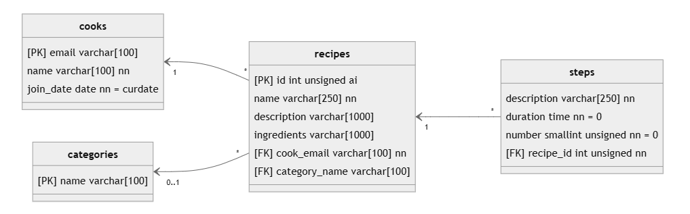

# Modèle relationnel de données (MRD)

Le modèle relationnel de données est un paradigme utilisé pour organiser et structurer des données sous forme de tables interreliées. Il a été introduit  en 1970 (!!) et constitue encore la base de l'organisation des bases de données relationnelles modernes.

## Principes fondamentaux du MRD

- **Tables** : Les données sont stockées sous forme de tables (relations) composées de lignes (enregistrements) et de colonnes (attributs ou champs).

- **Clés** primaires et étrangères :

    - Une clé primaire (Primary Key) est un identifiant unique pour chaque ligne d'une table.
    - Une clé étrangère (Foreign Key) est un lien entre une table et une autre.

- **Intégrité référentielle** : Assure la cohérence entre les relations (par exemple, une clé étrangère ne peut pas référencer une entrée inexistante).

- **SQL** : On utilise SQL (Structured Query Language) pour interroger et manipuler les données.

Dans un MRD, on place les tables, les attributs (colonnes) et leur type, les clés (PK, FK), les contraintes (UNIQUE, FK, etc.), les précisions (not null, default, etc.) ainsi que les liens entre les tables.

## Exemple bien connu

Cuisto!

Dans un exercice qui devrait vous être familier, on débute les questions de requêtes SQL en fournissant le MRD. Ce schéma est le fruit de questionnements, de décisions, d'optimisation en tables diverses. Plusieurs étapes vont nous mener à créer ce type de schéma pour un module précis ou une application plus complète.

Il faudra décortiquer et analyser tout ça et revenir faire un modèle relationnel de données avec plus de confiance! C'est l'un des objectifs de ce cours!

## Avantages du MRD

- Structure claire : facile à organiser avec des relations bien définies.
- Intégrité des données : grâce aux contraintes (clés primaires, étrangères). C'est conçu pour ça précisément et c'est sécuritaire.
- Utilisation universelle : Supporté par de nombreux systèmes de gestion de bases de données. (Il existe aussi des modèles non relationnels, NoSQL qui ne seront pas couverts dans ce cours).

## Propriétés ACID du SGBDR

Le système de gestion de bases de données relationnelles est aussi un acteur clé dans les transactions. Quatre propriétés essentielles définissent les **transactions** des bases de données relationnelles : atomicité, cohérence, isolement et durabilité, généralement appelées ACID.

- **Atomicité**: définit tous les éléments constituant une transaction de base de données complète. C'est "tout ou rien"

    - Exemple : Transfert bancaire
        - Si Alice envoie 100 $ à Bob :
        - La somme est retirée du compte d’Alice
        - La somme est ajoutée au compte de Bob

        Si une panne survient après l’étape 1 mais avant l’étape 2, la transaction est annulée pour éviter une perte d’argent.

        Mécanisme utilisé : Les bases de données utilisent des **journaux de transactions** (logs) pour restaurer l’état initial en cas d’échec.

- **Cohérence**: définit les règles permettant de maintenir les points de données dans un état correct après une transaction.

    - Exemple : Stock d’un produit
        - Si un e-commerce vend un article, la quantité disponible doit être mise à jour et ne jamais être négative.
        - Si le stock est à 1 et qu’un client achète :
        - Avant la transaction : Stock = 1
        - Après la transaction : Stock = 0

        Il est impossible que le stock devienne -1.

        Mécanisme utilisé : Contraintes d’intégrité (PRIMARY KEY, FOREIGN KEY, CHECK, NOT NULL).

- **Isolement**: conserve l’effet d’une transaction invisible aux autres jusqu’à ce que son engagement soit effectif, afin d’éviter toute confusion.

    - Exemple : Deux clients achètent le dernier article en stock
        - Le stock est 1.
        - Deux transactions (Client A et Client B) démarrent en même temps.
        - Sans isolation, les deux transactions peuvent voir le stock à 1 et valider l’achat… 
        - Résultat : Stock négatif et un client mécontent!

        Solution : Les bases de données utilisent des niveaux d'isolation (READ COMMITTED, REPEATABLE READ, SERIALIZABLE) pour éviter ces conflits.

- **Durabilité**: garantit que les modifications de données deviennent permanentes une fois que l’engagement de la transaction est effectif.
    - Exemple : Paiement validé
        - Si un client effectue un paiement et que la base de données valide la transaction, elle doit être enregistrée définitivement.
        - Même si le serveur plante juste après, la transaction ne peut pas être perdue.

        Mécanisme utilisé : Systèmes de journaux de transactions (Write-Ahead Logging, WAL) pour restaurer les données après une panne.

### Ressources:
- https://www.oracle.com/ca-fr/database/what-is-a-relational-database/ 

## Mais avant de se lancer...

Avant de créer un MRD de toute pièce, on doit se rappeler des notions de bases de la relation entre les tables et de l'intégrité référentielle.