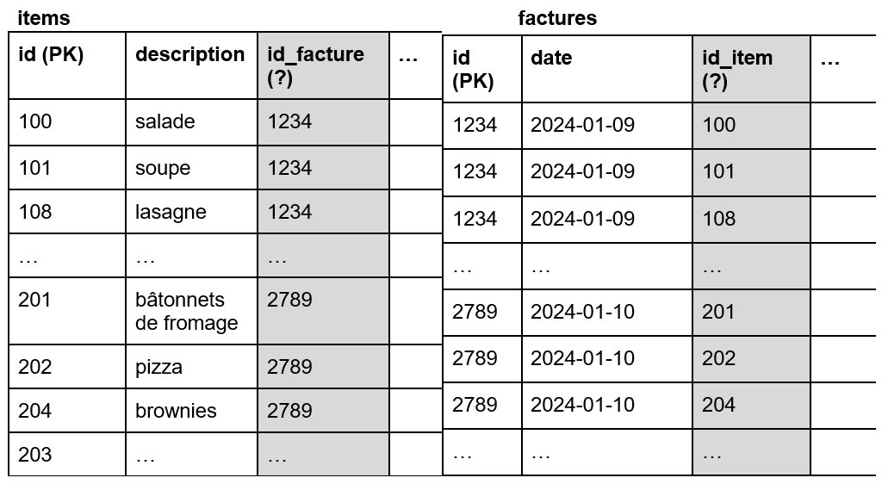
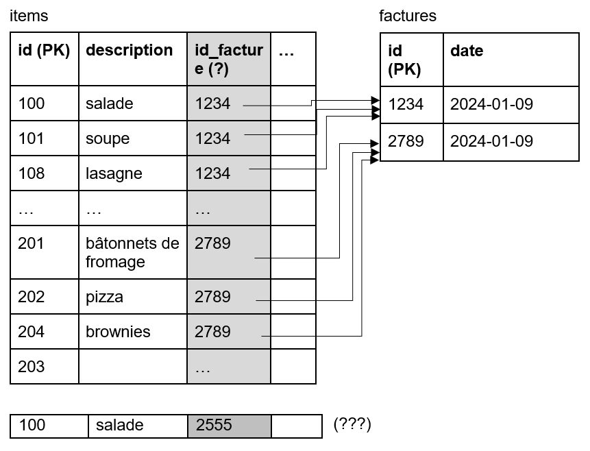
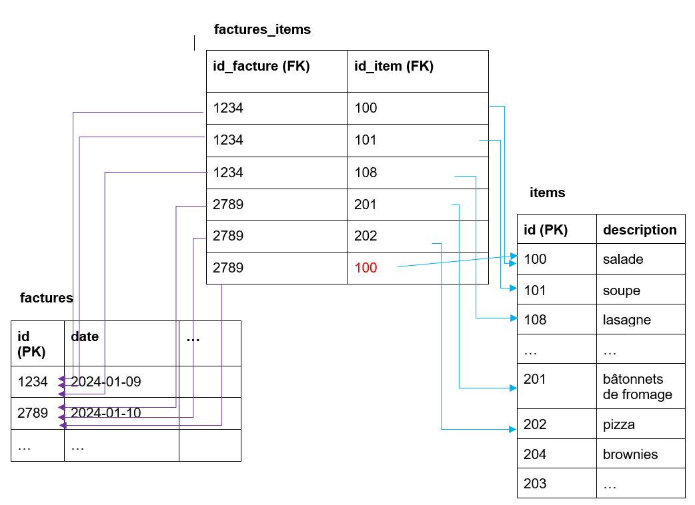

# Multiplicités

La multiplicité décrit combien de lignes dans une table correspondent à des lignes dans une autre table.

Dans l'exemple ci-haut, on a plusieurs multiplicités différentes. On ne tient pas compte des flèches pour lire les multiplicités, on peut les lire dans les 2 sens. On retrouve:

### relation 1 - * ou 1 - n 
entre recipes et steps. Ça se lit comme suit: chaque recette possède 0 à plusieurs étapes et chaque étape est associée à une et une seule recette.

| recipes  |  |   |   |  |
|-------|-------------|---------------|----------------|---------------|
| name  | description | ingredients   | cook_email     | category_name |
| nom A | AAA         | ingredients A | alice@mail.com | diner        |
| nom B | BBB         | ingredients B | alice@mail.com | souper        |
| nom C | CCC         | ingredients C | bob@mail.com   | souper      |
| nom D | DDD         | ingredients D | charlie@mail.com | souper      |
| nom E | EEE         | ingredients E | alice@mail.com | déjeuner      |
| nom F | FFF         | ingredients F | bob@mail.com | collation      |
| nom G | GGG         | ingredients G | alice@mail.com | déjeuner      |
| nom H | HHH         | ingredients H | charlie@mail.com | déjeuner      |

|  steps |  |  |  |
|-------------|----------|--------|-----------|
|  description | duration | number | recipe_id |
| étape A     | 0        | 1      | 1         |
| étape AA    | 00:01    | 2      | 1         |
| étape AAA   | 00:05    | 3      | 1         |
| étape B     | 00:06    | 1      | 2         |
| étape BB    | 00:01    | 2      | 2         |
| étape C     | 00:05    | 1      | 3         |
| étape D     | 00:02    | 1      | 4         |
| étape H     | 00:30    | 1      | 8         |
| étape HH    | 00:12    | 2      | 8         |
| étape HHH   | 00:13    | 3      | 8         |

- la recette E, par exemple, a 0 étape tandis que la recette A en a 3
- l'étape AAA, par exemple, n'appartient qu'à la recette 1, elle ne peut pas appartenir à d'autres recette dans ce contexte.
- Pourquoi le champ recipe_id est not null? Est-ce qu'il pourrait l'être?

### Variantes du 1 - *
En général, le symbole * signifie 0..* (entre 0 et plusieurs lignes associées). Si on veut préciser qu'il y a plus de 0, on écrit 1..\*. Une relation 1 - 1..* dans le contexte des recettes obligerait chaque recette à avoir au moins une étape. 

Comment se traduirait l'application de cette multiplicité dans l'implémentation?

### relation * - * 

Dans plusieurs cas, on aura des tables qui ont des associations de type plusieurs à plusieurs. Par exemple:
- un auteur peut avoir plusieurs livres et un livre peut avoir plusieurs auteurs. Est-ce qu’un auteur peut n’avoir aucun livre? Un livre peut-il avoir aucun auteur?
- une recette peut avoir plusieurs étapes et une étape peut se répéter dans plusieurs recettes. Une recette peut-elle avoir aucune étape? Une étape peut-elle être associée à aucune recette?
- une facture peut avoir plusieurs items et un item peut se vendre dans plusieurs factures. 
- etc.

Si on imagine des items et le factures, on a la table item qui identifie l'item disponible pour la vente par son identifiant unique et sa description... Dans la table facture, on a un identifiant unique et une date de facturation. Dans quelle table mettre la FK vers l'autre?

Cette situation sème la confusion... Essayons de mettre la FK dans la table items. Dans ce cas, on force l'item à appartenir à une seule facture (très mauvais pour les affaires!). Si la salade a une référence vers la facture 1234, plus aucune autre facture ne pourra avoir de salade... En effet, l'insertion d'une autre ligne avec de la salade briserait l'unicité de la PK:

Si on fait l'autre choix, de mettre la FK dans la table factures qui pointe vers la table items, on n'est pas plus avancés...une facture ne pourra contenir qu'un seul item pour éviter un doublon de PK sur le numéro de facture...

## Solution: Table de liaison!

Cette situation se produit parce que nos tables ont besoin de pointer vers plusieurs éléments, dans un sens ou dans l'autre... C'est une liaison dont la multiplicité est PLUSIEUR à PLUSIEURS. Il faut donc absolument une table de liaison pour parvenir à modéliser ces tables.

On a donc l'ajout d'une table qui contient que des lignes uniques: des duos de factures-items. On ne peut pas avoir 2 fois la même salade sur la même facture. On peut avoir une QUANTITÉ de salades identiques supérieure à 1, mais il s'agit du même item. 

Comment indiquer qu'on a vendu 3 bâtonnets de fromage sur une facture? Et bien dans une facture, on a l'item "bâtonnet de fromage" une fois et on ajoute une colonne quantité dans la table de liaison!

