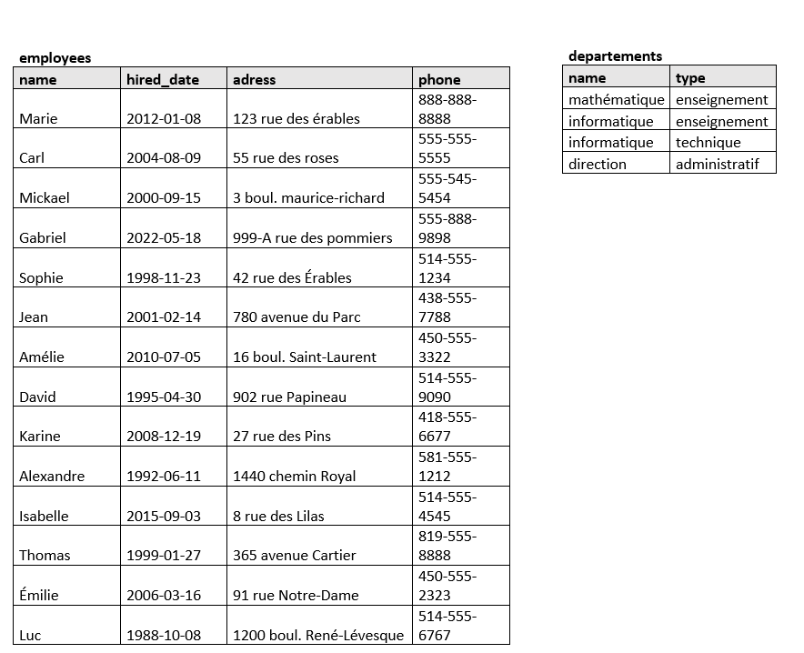

# Exercices

## Question 1
Dans cette situation avec ces 2 tables, on parle des employés et de leur affiliation à un département. Le format Excel est fourni, si vous voulez ajouter des colonnes ou des flèches. Choisir l'onglet Q1-emp-dept.

a) Identifier/ajouter la PK dans chaque table, avec justification du choix fait.

b) Choisissez et expliquer votre choix de multiplicité entre les tables. Ajouter les éléments nécessaires pour appuyer votre décision. Expliquer également un AUTRE choix qui aurait pu être plausible. Votre analyse / justification doit parler des FK, attributs (not null, unique, default) et de l'ajout ou non d'une table de liaison.

c) Donner des exemples d'insertion qui devraient fonctionner dans chacune des tables et des insertions qui ne fonctionneront pas, selon votre logique en a) b).

## Question 2
Dans cette situation avec 2 tables, on parle d'employés et de leurs projets.

a) Identifier/ajouter la PK dans chaque table, avec justification du choix fait.

b) Quelle question auriez-vous pour réussir à établir une multiplicité dans cette situation, si rien de plus n'est précisé?

c) Choisissez et expliquer votre choix de multiplicité entre les tables. Ajouter les éléments nécessaires pour appuyer votre décision. Expliquer également les questionnements qui auraient pu changer vos choix. Votre analyse / justification doit parler des FK, attributs (not null, unique, default) et de l'ajout ou non d'une table de liaison.

## Question 3

D'après le diagramme suivant, proposez les multiplicités entre les tables. Dans le processus:

- Notez les questions qui vous viennent à l'esprit pour préciser votre compréhension de la situation et du processus métier derrière.
- Établissez les clés PK avec justification des choix faits
- Choisissez et expliquer votre choix de multiplicité entre les tables. Ajouter les éléments nécessaires pour appuyer votre décision.
- Votre analyse / justification doit parler des FK, attributs (not null, unique, default) et de l'ajout ou non d'une table de liaison.
