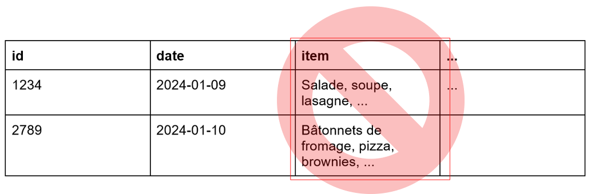
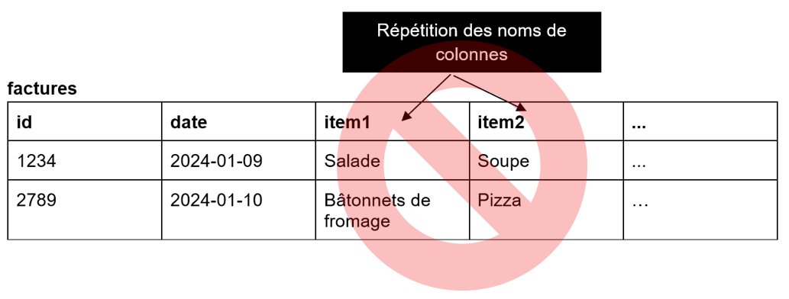
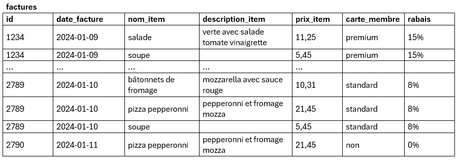
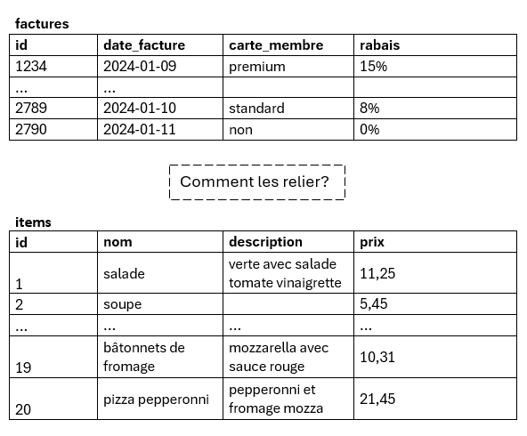
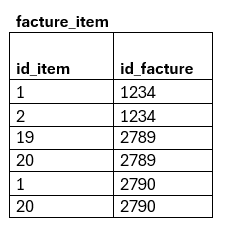
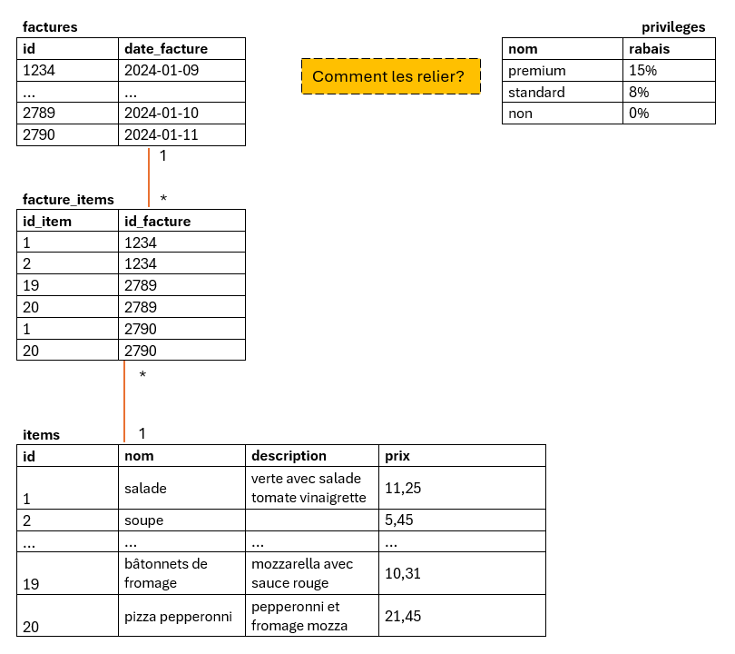
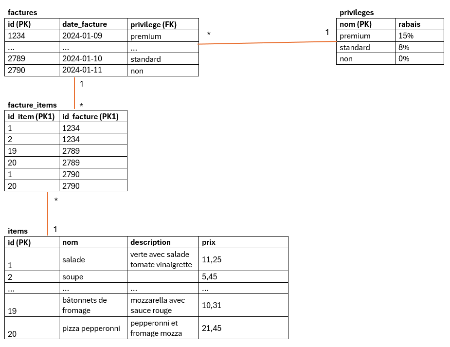
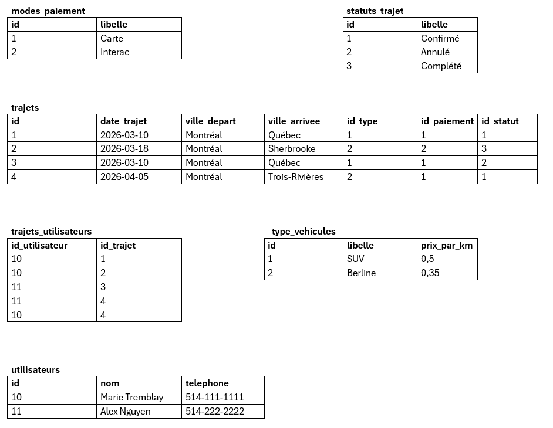

# Normalisation

La normalisation, c'est le processus de l’organisation des champs et des tables pour réduire la redondance des données et les anomalies (update, delete, insert). Il a pour but de s’assurer de protéger l’intégrité des données.

Chaque table contient des données sur un seul sujet (entité) et une seule chose. La forme universelle (UNF) est la collection de toutes les données en relation (qui est généralement fortement redondante). On va vouloir remplacer par une collection de relations non-redondantes en faisant attention de ne pas perdre d’information (perdre une ou plusieurs colonnes ou bien faire des associations erronées lors de la jointure des tables).

La normalisation est une des façons de créer un système de table en partant de 0.

# Première forme normale (1NF)
Dans cette étape, on aplatit les données brutes en mettant des noms de champs et les valeurs à l’intérieur. On part d’une situation réelle et on énumère les informations utiles. Il faut donc réfléchir aux champs à mettre dans une première version de table. On va « mettre à plat » les d
données. Si on prend une situation de la vie courante, comme la production d'une facture, on va décortiquer les étapes pour parvenir d'une situation vers une proposition de MRD.

Pour chacune des tables, tous les champs ne devraient contenir **qu’une seule valeur** et n’avoir aucun groupe qui se répète. Chaque enregistrement (ligne) doit être unique.

Les règles sont :
-	Une seule valeur et un seul type par colonne
-	Les valeurs dans les colonnes sont « atomiques », c’est-à-dire qu’on ne peut pas les décomposer plus.
-	Il faut une clé primaire
-	Pas d’attributs qui se répètent (item1, item2…)

Cet exemple ne respecte pas la 1NF, car il y a un groupe d’information qui se répète. On pourrait être tenté de séparer les champs item1 et item2 dans une seconde table comme ceci:

Par contre, le nombre de colonnes variable est très peu recommandé... On peut faire ceci à la place, on éliminera la redondance dans les étapes suivantes de normalisation

Maintenant, chaque enregistrement (ligne) est unique, chaque case contient une seule valeur et on a une clé primaire. Les données sont aplaties, en forme 1NF.

# Deuxième forme normale (2NF)

Il faut choisir la clé primaire PK (composée ou non) en se demandant si tous les autres champs dépendent de cette clé.

La deuxième forme normale (2NF) indique qu’il faut séparer les champs d’une table si ceux-ci ne sont pas définis par les champs identifiants (clés). Il faut aussi que la table respecte les critères de la 1NF

En d’autres mots : est-ce que les colonnes dépendent de la totalité de la clé primaire?

### Exemple de la facture:

Table en 1NF:

Elle n’est PAS en 2NF. En effet, les attributs « non-clé » (tous sauf id) ne dépendent pas exclusivement de la PK de cette table. En effet, la description et le prix d'un item, par exemple, ne servent qu'à décrire l'item.

Il faut donc une table pour les items à part! Tous les champs qui ont rapport à l'item sont dans une autre table.

Il ne faut pas perdre de l'information, on doit savoir quel item appartient à quelle facture! Comment les relier? On se demande: une facture peut avoir "combien" d'items (0,1, plusieurs?)... et un item, peut être sur combien de factures (0,1 plusieurs). Dans le doute, on illustre!

La facture possède de une à plusieurs items, les items apparaissent dans 0 à plusieurs facture... On a une liaison * - *, donc la table de liaison est nécessaire! facture_item.

# Troisième forme normale (3NF)

La troisième forme normale doit :
- d’abord être en 2NF et 
- s’assurer qu’un attribut non-identifiant ne dépend pas d’un autre attribut non-identifiant.
- pas de transitivité (dépendre d'un champ qui dépend de la clé)

Cela signifie que la modification d’une colonne non-clé pourrait entraîner le changement d’une autre colonne non-clé. C'est aussi à cette étape qu'on va extraire des tables **lookup** (table servant de liste de valeurs fixes, qui changeront jamais ou rarement).

Dans notre exemple, on ne respecte pas la 3NF, parce que le rabais octroyé (colonne non-clé) dépend uniquement de la colonne carte_membre (colonne non-clé).  On les sort de là!

Entre factures et privilèges, on analyse qu'une facture a un seul niveau de privilège, mais que les niveaux de privilèges apparaissent dans plusieurs factures. Une clé de l'enfant vers le parent sera suffisante! relation 1 - *. Au final, les tables normalisées suivent le schéma suivant:

Il aurait pu être judicieux aussi de mettre une PK artificielle à la table privileges.

### Autres formes normales

à titre indicatif, les autres formes normales se nomment
-	BCNF (Boyce Codd normal form)
-	4NF
-	5NF

Dans la majorité des cas, si une table est en 3NF, elle est complètement normalisée. Gardez en tête la phrase suivante :

** Les champs doivent dépendre de la clé, entièrement de la clé et seulement de la clé dans la table où ils se trouvent. ** 

### Exemple 2

On souhaite modéliser une plateforme de covoiturage. Après un brainstorm, on a les informations suivantes:
- un utilisateurs et ses informations (chauffeur ou covoitureur)
- une date de départ
- une heure de départ
- un endroit de départ
- un endroit d’arrivée
- un type de véhicule
- un mode de paiement
- un statut (confirmé, annulé, complété)
- un prix standard par km parcouru à payer pour le trajet 

D'autres champs pourraient être ajoutés comme l'heure de départ, le lieu exact de départ (adresse, spécification), l'ajout de commentaires, de détails sur la voiture, le "rating" de l'utilisateur, le rôle de l'utilisateur, le montant payé au chauffeur, etc. Pour l'exemple, on gardera seulement les info ci-haut.

| id_utilisateur | nom            | téléphone    | trajets                                                                                                                                |
| -------------- | -------------- | ------------ | -------------------------------------------------------------------------------------------------------------------------------------- |
| 10             | Marie Tremblay | 514-111-1111 | 2026-03-10 Montréal → Québec (SUV, Carte, Confirmé, 0,50$ par km); 2026-03-18 Montréal → Sherbrooke (Berline, Interac, Complété, 0,35$ par km) |
| 11             | Alex Nguyen    | 514-222-2222 | 2026-03-10 Montréal → Québec (SUV, Carte, Annulé, 0,50$ par km); 2026-04-05 Montréal → Trois-Rivières (Berline, Carte, Confirmé, 0,35$ par km) |

La forme ci-haut est en UNF. Pour la mettre en 1NF, il faut suivre les règles! 
- chaque colonne a un type 
- chaque cellule a une valeur atomique
- présence d'une clé primaire
- pas de colonne qui se répète pour énumérer des info de même type

### Mettre en 1NF:

| id_utilisateur | nom            | telephone    | date_trajet | ville_depart | ville_arrivee  | type_vehicule | paiement | statut   | prix_par_km |
| -------------- | -------------- | ------------ | ----------- | ------------ | -------------- | ------------- | -------- | -------- | -------------------- |
| 10             | Marie Tremblay | 514-111-1111 | 2026-03-10  | Montréal     | Québec         | SUV           | Carte    | Confirmé | 0,50                 |
| 10             | Marie Tremblay | 514-111-1111 | 2026-03-18  | Montréal     | Sherbrooke     | Berline       | Interac  | Complété | 0,35                 |
| 11             | Alex Nguyen    | 514-222-2222 | 2026-03-10  | Montréal     | Québec         | SUV           | Carte    | Annulé   | 0,50                 |
| 11             | Alex Nguyen    | 514-222-2222 | 2026-04-05  | Montréal     | Trois-Rivières | Berline       | Carte    | Confirmé | 0,35                 |

Ci-haut, chaque information différente (ville de départ, arrivée, statue, etc.) est dans une cellule unique. La clé primaire naturelle composite serait (id_utilisateur, date_trajet, ville_depart, ville_arrivee) pour identifier un trajet sans ambiguïté.

Mais la règle d'or n'est pas encore respectée! **Les champs doivent dépendre de la clé, entièrement de la clé et seulement de la clé dans la table où ils se trouvent.**

### 2NF (éliminer les dépendances partielles)

le nom et le téléphone ne servent qu'à identifier l'utilisateur. On crée donc une table pour les détails d'un utilisateur pour éviter de répéter (risque d'anomalies!). aucun autre champ ne décrit partiellement un des 4 champs qui forment la clé composite. Le changement ci-dessous serait alors suffisant pour statuer qu'on est en 2NF:

utilisateurs
| id | nom            | téléphone    |
| -------------- | -------------- | ------------ |
| 10             | Marie Tremblay | 514-111-1111 |
| 11             | Alex Nguyen    | 514-222-2222 |

 

trajets
| id | date_trajet | ville_depart | ville_arrivee  | type_vehicule | paiement | statut   | prix_par_km |
| --------- | ----------- | ------------ | -------------- | ------------- | -------- | -------- | -------------------- |
| 1         | 2026-03-10  | Montréal     | Québec         | SUV           | Carte    | Confirmé | 0,50                 |
| 2         | 2026-03-18  | Montréal     | Sherbrooke     | Berline       | Interac  | Complété | 0,35                 |
| 3         | 2026-03-10  | Montréal     | Québec         | SUV           | Carte    | Annulé   | 0,50                 |
| 4         | 2026-04-05  | Montréal     | Trois-Rivières | Berline       | Carte    | Confirmé | 0,35                 |

#### Comment relier les tables? 

Puisque un utilisateur peut avoir plusieurs trajets et qu'un trajet va impliquer plusieurs utilisateurs, on a une relation plusieurs à plusieurs. Il faut donc une table de liaison!

reservations
| id_utilisateur | id_trajet |
| -------------- | --------- |
| 10             | 1         |
| 11             | 1         |
| 10             | 2         |
| 10             | 3         |
| 11             | 4         |
| 11             | 5         |

Chacune des 3 tables a une clé primaire composite viable, on se posera la question à la fin si on ajoute une PK artificielle.

### 3NF (lookups et dépendances transitives)

Si on se fie à la clé primaire naturelle composite choisie dans la table initiale: (id_utilisateur, date_trajet, ville_depart, ville_arrivee), on se demande s'il y a des champs non-clé qui sont attachés à un autre champ non-clé. 

On découvre que le prix standard par km dépend du type de véhicule. Les 2 infos décrivent les détails d'un trajet sans être des clés qui décrivent un trajet. Si on change le type du véhicule, on ajustera automatiquement le prix par km. On doit donc sortir cette info de la table trajets.

Note: il n'y a pas de moment parfait pour extraire les lookups, on choisis souvent de le faire à la fin puisque c'est un détail qui n'a pas d'incidence sur la logique métier. On va donc en profiter ici pour faire une lookup pour les champs: 

- ville_dapart/ville_arrivee
- type_vehicule
- paiement
- statut

En 3NF on aurait donc les tables suivantes:

## Exercice

Suite à l'exemple 2 sur le covoiturage, répondre aux questions ci-dessous:

1. Faire les liaisons entre les tables et indiquez les multiplicités. S'il y a plusieurs choix possibles, indiquez ce qu'il manque comme information pour choisir.

2. Si on ajoute les champs suivants, on les mettrait respectivement dans quelle table? Ajoutez-les dans le chiffrier Excel et ajoutez des valeurs fictives dans les champs.

    - email
    - heure de départ
    - indiquer un détail pour le trajet (exemple: pas de chien, nourriture permise, grande valise ok, etc.)
    - indiquer qui est le conducteur

3. Est-ce qu'il serait judicieux de mettre les noms de villes dans une lookup? Pourquoi?