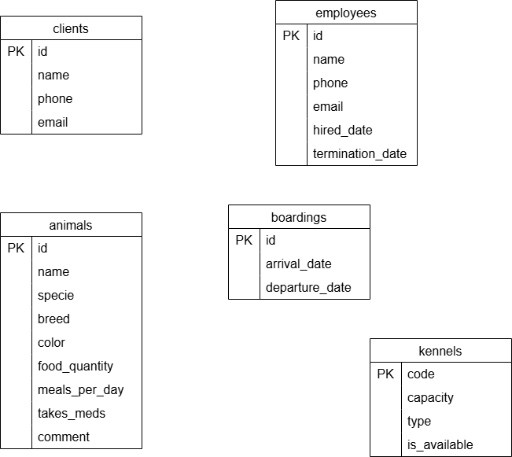
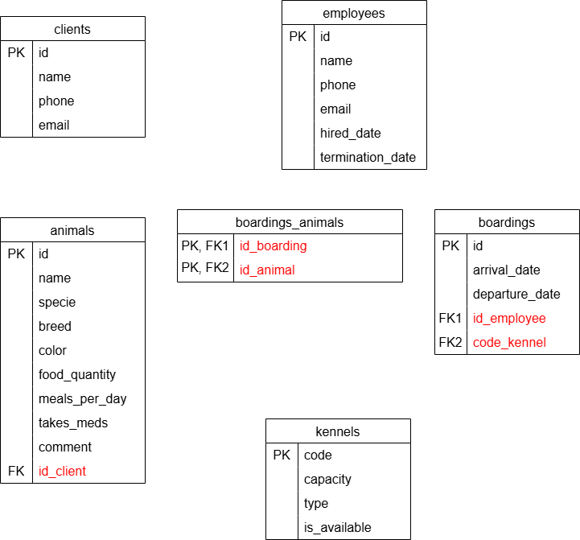
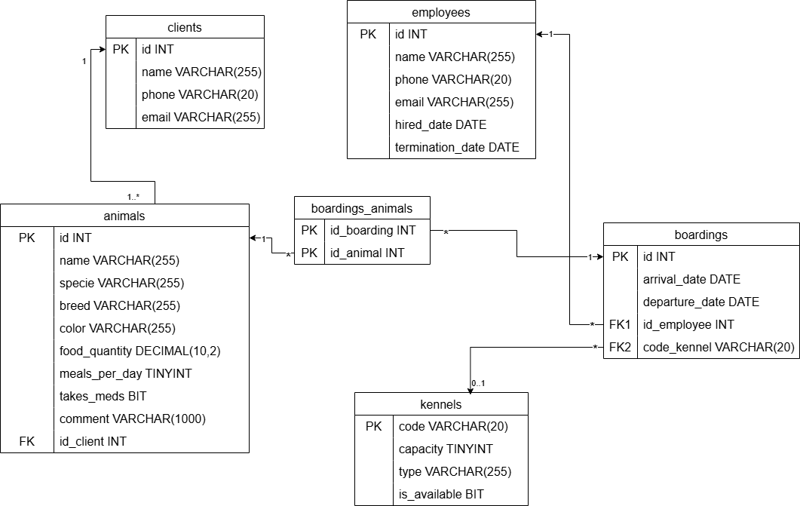
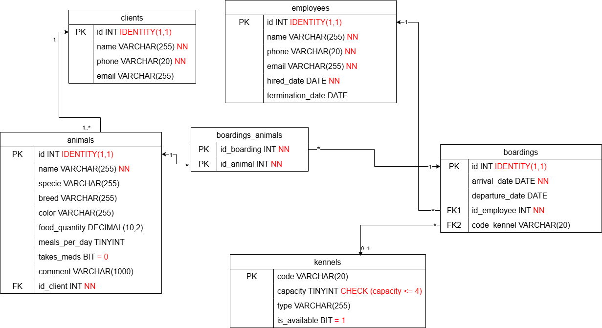

# Création du MRD

## Étape 1
Selon la situation, énumérer les champs qui nécessitent d'être stockés quelque part dans une base de données. Il est possible que certaines tables se définissent de manière évidente, sinon, appliquer la normalisation (1NF, 2NF, 3NF) pour vous aider.

## Étape 2
Choisir les clés et les liaisons entre les tables (multiplicités). Ajuster les PK et les FK. 

## Étape 3
Ajouter les types des colonnes, les valeurs par défaut, les CHECK, not null, et auto-incrémentation.
- Pour les NOT NULL, demandez-vous si une ligne PEUT être enregistrée en BD SANS avoir cette information.
- Ne pas oublier que les PK sont d'emblée not null et unique, ne pas le répéter dans le script.
- Est-ce qu'il y a une valeur par défaut qui serait intéressante? Pensez toujours à un formulaire, que faire avec les champs vides?

## Étape 4
Dessiner le MRD avec draw.io

Règles à garder en tête pour les choix de type de champs de BD:
- uniformiser les type d'une table à l'autre en BD. Par exemple, si on prend un VARCHAR(255) pour un nom dans une table, mettre toujours le même format pour le nom dans les autres tables. Il en est de même pour les types numériques.
- uniformiser aussi l'écriture et les noms de champs. La plupart des compagnies ont déjà un standard et il est important de ne pas déceler qui a fait quelle partie de code ou de BD. Par exemple, mettre tout en anglais ou tout en français. Garder le même format de nom (id_nom_de_la_table pour les FK). Mettre tout en minuscule et snake_case.
- Les noms de tables sont au pluriel et les noms de champs au singulier

## Exemple de MRD à partir d'une situation:

Vous avez un propriétaire de pension pour animaux qui vous demande de schématiser une application pour gérer sa petite entreprise. Il veut pouvoir garder les informations sur les animaux qui profiterons de la pension chez eux (nom, espèce, race, couleur, quantité de nourriture par repas, nombre de repas par jour, la prise ou non de médicament au moment de la pension, etc.). Les informations sur la pension elle-même doivent aussi être pris en considération. Les animaux sont mis dans des enclos la nuit et les enclos ont un code alphanumérique. Ils peuvent être seuls dans l’enclos ou bien être mis en pension avec d’autres animaux. La capacité des enclos est de 4 animaux maximum. On veut garder une trace de quel employé a entré la réservation. L’employé va prendre en note la date d’arrivée, la date de départ et les informations du client qui est propriétaire de l’animal ou des animaux.

### Pour réaliser le MRD (trucs)

- faire des tables par "grands sujets" et faire des listes de champs "évident". Il est aussi très possible de penser à la normalisation en partant du 1NF pour séparer les tables.

Faire un "premier jet", on pense aux noms et aux infos de chaque grand sujet:

- les champs qui contiennent des informations qui sont détaillées dans les autres tables sont soit des FK, soit ils iront dans une table de liaison. Par exemple, le propriétaire de l'animal est une FK dans *animals* (un animal a un seul propriétaire), mais le nombre d'animaux dans une pension sera un champ calculé (on a une relation plusieurs à plusieurs entre pensions et animaux (*boradings* - *animals*))

- On peut ensuite relier les tables et mettre les multiplicités
- Puis, on ajoute les types de colonne

Finalement, on ajoute les attributs comme not null, identity(1,1), default (=_), check ()...

