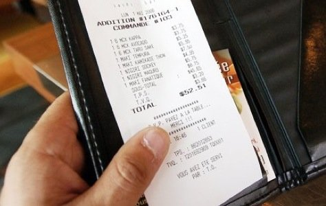
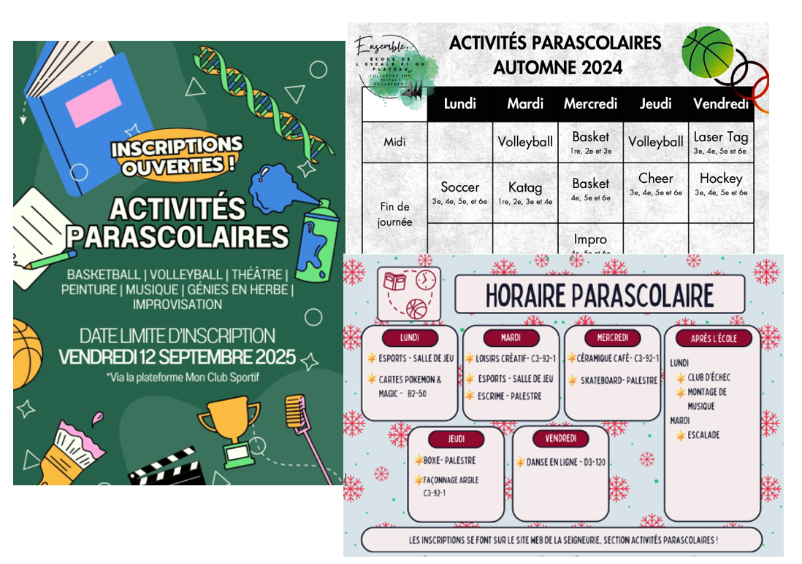

# Exercice

Pour toutes les questions:

Faire le modèle relationnel des données. Celui-ci inclut:
- le schéma des tables sur draw.io, avec les titres et les champs
- les liens entre les tables avec la multiplicité à chaque bout
- les champs avec leur TYPE et leur spécificité (UNIQUE, NOT NULL, etc.)
- les PK et FK
- les tables de liaison s'il y a lieu
- le type des champs

# Question 1
Application de gestion pour un atelier mécanique

Un propriétaire d’atelier mécanique souhaite faire développer une application pour gérer son entreprise. Il veut conserver les informations sur :

- Les clients (nom, téléphone, courriel)
- Les véhicules appartenant aux clients (plaque, marque, modèle, année, kilométrage)
- Les réparations / entretiens
- Chaque véhicule peut venir plusieurs fois à l’atelier.

Lors d’une visite, on veut enregistrer :

- la date
- le problème signalé par le client
- les travaux effectués
- le coût total
- quel employé a pris en charge le véhicule

Certaines réparations nécessitent des pièces. On veut donc garder les informations sur :

- les pièces (nom, prix, quantité en stock)

Les employés ont :

- un numéro d’employé
- un nom
- une spécialité (ex : moteur, freins, électricité)

# Question 2

Faire le MRD associé avec la gestion des factures d'un restaurant. Inspirez-vous d'une facture dans vos poches ou trouvée sur internet. Sinon en voici une:

# Question 3

Dans une école, un étudiant veut organiser diverses activités pendant les heures du midi et après l'école. Si on a l'intention de développer une petite application pour aider la gestion, il faudra inévitablement conserver des informations. Proposez un MRD et notez les questions qui vous sont venues 

