# Interface utilisateur

## L'interface, c'est important?

OUI, c'est important, c'est même CRUCIAL. Ça influence directement la satisfaction des utilisateurs et l'efficacité des systèmes, ça peut faire la différence entre le succès et l'échec d'un projet. Une interface bien conçue facilite l'interaction, réduit les erreurs et améliore la productivité.

### Interface orientée utilisateur

- Parfois, nous ne nous attendons pas à ce que quelqu'un utilise certains produits de différentes manières.

- C'est pourquoi il est important de parler avec les utilisateurs finaux et aussi de les observer.

- Lorsque nous restons dans notre "bulle" à résoudre des problèmes par nous-mêmes, nous nous retrouvons avec un produit basé sur nos conventions limitées.

## Les règles d'or de Mandel/Nielson

Dans le passé, les interface utilisateurs des logiciels étaient faites pour que l'utilisateur s'y conforme et s'adapte à lui. 

De nos jours, les interfaces doivent être adaptées pour que l'utilisateur soit au CENTRE. On va voir plusieurs principes qui sont des sous-catégories des groupes suivants:
- Donner à l’utilisateur le contrôle de l’interface (10 sous-points)
- Réduire la charge cognitive de l’utilisateur (9 sous-points)
- Créer une interface qui est consistante (5 sous-points)

Regardons en détail:

## Donner à l’utilisateur le contrôle de l’interface

1. **Utiliser judicieusement les modes d’affichage (modeless)**
- L’utilisateur sait exactement dans quel mode il se retrouve, car il l’a activé
- Il y a une indication claire. Exemples : 
    - Bouton gras qui reste activé quand on l’active
    - Les palettes spéciales apparaissent dans Word pour les éléments particuliers, Le menu dans lequel on est est souligné et montre les fonctionnalités qui y sont rattachées seulement.

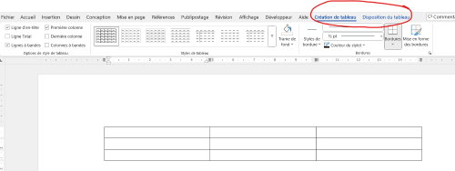

2. **Utilisation des techniques d’interaction appropriées (flexible)**
- Clavier, souris, écran tactile, vocale, etc.
    - Exemple : Sur un téléphone, l’utilisation d’une glissoire pour ajuster la brillance de l’écran
    - Possibilité de prendre la souris ou le clavier pour naviguer, même les commandes vocales.

3. **Autoriser les utilisateurs à perdre le focus (interruptible)**
    - Ex : L’utilisateur peut être interrompu par un appel téléphonique. Il doit être en mesure de continuer où il était rendu.

4. **Afficher du texte et des messages significatifs (Helpful)**
    - Exemple : Le champ exige un courriel, un message d’erreur affiche que le courriel doit avoir un format valide
    - Contre-exemple : « Une erreur est survenue »… oui, mais encore?
    [autres exemples](https://community.spiceworks.com/t/10-hilarious-error-messages-facepalm-worthy-computer-prompts-that-make-no-sense/629033)
    
5. **Fournir des actions immédiates et réversibles et du feedback (forgiving)**
    - Exemple : La commande « Annuler »
    - Contre-exemple: On clique quelque part et on ne voit pas le progrès ou on n'a pas l'impression que ça "travaille" derrière.

6. **Fournir des chemins et sorties qui ont du sens (navigable)**
    - On peut facilement prendre plusieurs chemins à partir du contexte d’utilisation.

7. **Accommoder les utilisateurs avec différents niveaux d’habileté (accessible)**
  
    Une application doit être utilisable par :

      - des débutants (utilisateur lambda)
      - des utilisateurs avancés (power users)

8. **Faire une interface « transparente » (facilitative)**
   
   L’utilisateur ne doit pas réfléchir à comment utiliser l’application.
    Il se concentre sur sa tâche, pas sur l’interface.

9.  **Permettre à l’utilisateur de personnaliser l’interface (preferences)**
    Pouvoir choisir le thème, l'emplacement des fenêtres, la taille des sections, etc.

10. **Permettre à l’utilisateur de manipuler les objets directement (interactive)**

    Éviter les clics multiples pour faire une tâche. Par exemple:
    - choisir le drag'n'drop plutôt que menu -> déplacer -> etc.

## Réduire la charge cognitive de l’utilisateur 

1. **Réduire la mémoire à court terme (Souvenir)**
    - La règle générale c’est que l’humain a une mémoire de 7 ± 2 items
    - La séparation en bloc facilite la mémorisation

    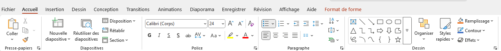

    - Autres exemples:
        - Gestionnaires de mots de passes
        - Auto-complétion dans les champs de formulaire

2. **Se fier à la reconnaissance et non au rappel (Reconnaissance)**

- Garder en mémoire les dernières recherches:

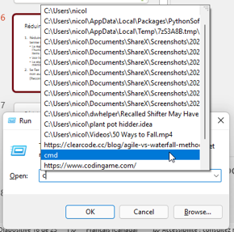

- Faire des listes cliquables plutôt que des champs à écrire.

3. **Fournir des indices visuels ou auditifs (Information)**
- Dans les interface d'application graphiques, il faut savoir en tout temps OÙ on est, QU'EST-CE qu'on fait et QUE PEUT-ON faire ensuite. 
    - Dans Word par exemple:

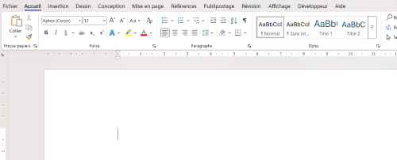

- C'est aussi dans cette optique qu'on entend des bruit de clavier quand on tape sur un smartphone, qu'il y a un bruit de photo ou un clic quand on ferme le téléphone.

4. **Fournir des valeurs par défaut, l’annulation et la reproduction (Pardon)**
    - Exemple : Commande « Annuler »
    - Les copies de sauvegarde automatiques (versions)

5. **Fournir des raccourcis d’interface (Fréquence)**
    - Les raccourcis claviers connus doivent fonctionner (ctrl + z, ctrl + c, ctrl + x, etc.)
    - On doit pouvoir guider l'utilisateur dans l'application via les contrôles de clavier: naviguons dans Word
    
6. **Promouvoir la syntaxe « un objet – une action » (Intuitif)**
    - Exemple : Quelles actions puis-je effectuer avec numéro de téléphone dans la liste de contact? Essayez-le

7. **Utiliser des métaphores du monde réel (Transfert)**
   - Utiliser des images de la vie de tous les jours pour que l'action soit intuitive

8. **Utiliser la divulgation progressive (Contexte)**
    - Permettre à l’utilisateur d’avoir plus d’information au fil des clics
    - Exemple : Plusieurs menus dans Omnivox

9. **Promouvoir la clarté visuel (Organisation)**
   - Ne pas trop en mettre, laisser l'espace épuré
   - La surcharge d'information n'est pas plus informative...
   - Organiser de manière uniforme. Voici un CONTRE-EXEMPLE d'une bonne organisation:

        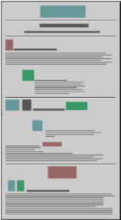

        Et un meilleur exemple:

        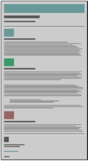

## Créer une interface qui est consistante

1. **Garder le même contexte que la tâche actuelle (Continuité)**
- On ne doit pas avoir à changer de fenêtre quand on complète une tâche. Si on a une tâche avec étapes successive, laisser les éléments le plus possible aux mêmes endroits.

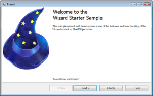

2. **Maintenir une consistance à l’intérieur et au travers les produits (Expérience).**
- Chaque bouton, chaque écriture, chaque item permettant une action ne doit pas changer inutilement à l'intérieur de l'application
- Le comportement de chaque item ne change pas dans une même application
- Permettre aussi des éléments consistants d'une plateforme à l'autre (produits Apple, Jetbrains, Office, etc.)

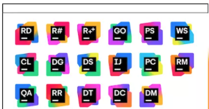

3. **Garder les résultats d’interaction identique (Attente)**
    - Faites en sorte que les choses fonctionnent comme elles en ont l’air (interaction consistante)
    - Contre-exemple: Cliquer sur un lien qui change de couleur en passant dessus, mais qui ne mène nulle part.
    
4. **Fournir un charme esthétique et intègre (Attitude)**
   - Il ne faut pas que ça paraisse que le code ou le produit finit a été fait par des équipes distinctes qui ne se sont pas tellement parlé
   - Utiliser une uniformité de couleurs, polices, titres, etc.

5. **Encourager l’exploration (Prédictible)**
   - Les design doivent donner envie à l'utilisateur d'explorer, d'essayer, et même de s'amuser avec les éléments de l'interface sans craindre les conséquences négatives.
   - Par exemple, les tutoriels de jeux qui nous pointent où cliquer

[Source: Règles d'or de Mandel](https://theomandel.com/resources/golden-rules-of-user-interface-design/)

[Source détaillée](https://theomandel.com/wp-content/uploads/2012/07/Mandel-GoldenRules.pdf)

## Règles générales

   - Éviter les fautes d'orthographe
   - Toujours le même alignement pour le même type de contrôle
       - Exemple : Les étiquettes toujours alignées à gauche ou à droite pour toute l’application
   - Connaître les utilisateurs
   - Des actions simples à effectuer, boutons clairs

Les règles d'or de Mandel, bien qu'écrites en 1997, restent à la base de tout bon design d'interface. Toutefois, quelques éléments on évolué depuis. Il est maintenant primordial de s'adapter au mobile et multi-plateforme (à l'époque de Mandel, c'était surtout desktop). Il faut penser "mobile-first", responsive design et interactions tactiles (swipe, gestes) plus qu'il y a 30 ans.
  

[Material design](https://m3.material.io/)

[Apple guidelines](https://developer.apple.com/design/human-interface-guidelines/)

[heuristique de Nielson](https://www.nngroup.com/articles/ten-usability-heuristics/)

# Section "Risque de blessures à la rétine"

Qu'est-ce qui cloche dans les exemples suivants? Quels principes ne sont pas respectés?

1. Application scolaire

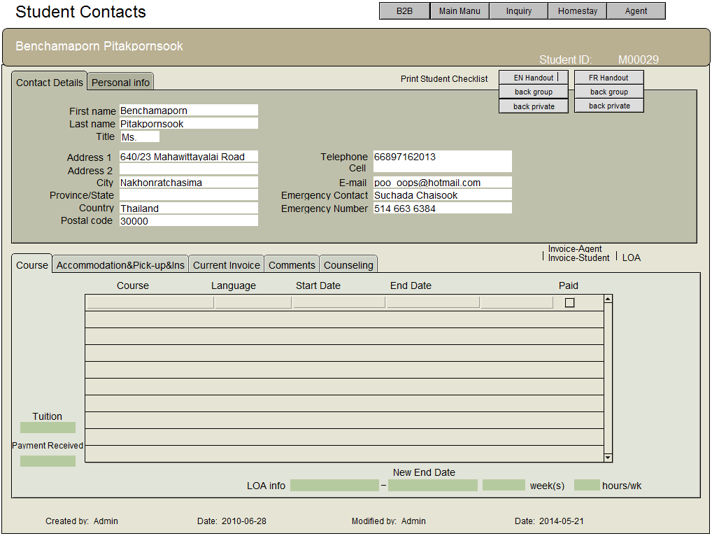

2. [Quelques exemples ici](https://www.interaction-design.org/literature/article/bad-ui-design-examples)

3. [Attention aux yeux!](https://www.nrao.edu/software/fitsview/)

4. [Agence du revenu du Canada](https://www.canada.ca/fr/agence-revenu.html)

5. Pool de hockey:
   
   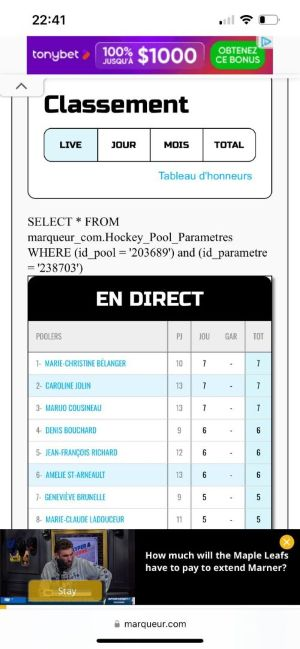

# Maquettes

On a vu jusqu'à présent comment organiser les données en MRD et en faire le script de création de tables. On a aussi vu comment créer, consulter,  mettre à jour et supprimer des données en BD (CRUD).

Maintenant, franchissons une étape de plus vers la construction d'une application ou d'un site. On fera la maquette de l'application et on y liera le MRD.

- Une maquette représente ce que l’utilisateur voit
- Un MRD représente ce que le système stocke

Chaque élément de la maquette correspond souvent à une table, attribut ou relation. 

Ce qui importe dans ce cours, c'est la structure, bien avant la beauté du design. En général, un bon point de départ est le suivant:

| Maquette               | MRD                              |
|------------------------|----------------------------------|
| Champ texte            | Attribut (colonne)               |
| Liste                  | Table                            |
| Bouton (icône)         | Action (INSERT, UPDATE, DELETE)  |

## MRD à partir d'une maquette

Voici une maquette de magasinage en ligne

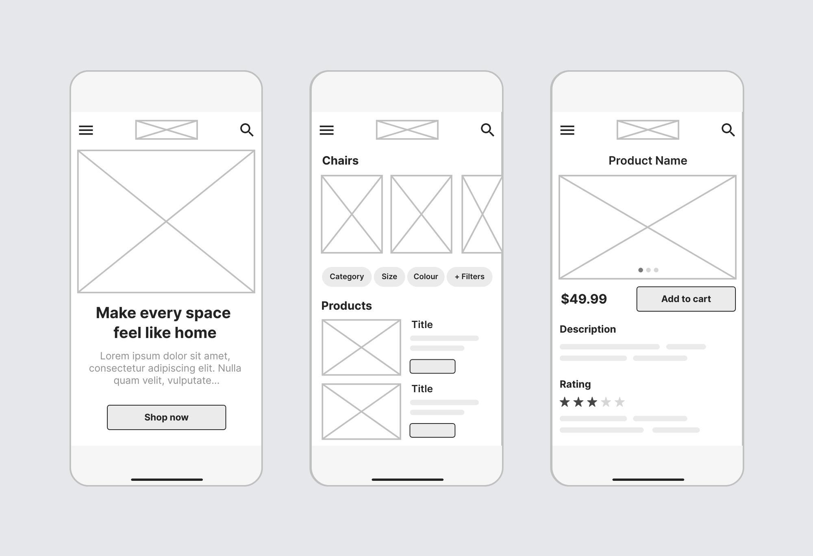

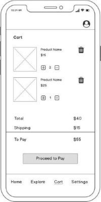

[source](https://careerfoundry.com/en/blog/ux-design/website-app-wireframe-examples)

On voit ici des écrans typiques:
- Écran d'accueil
- Liste des produits
- Détails des produits
- Panier

Quelles seraient les tables? Les champs dans ces tables? Les actions?

### Réponse:
Dans la maquette, on a quelques grands sujets: 
- produits
- commandes
- clients (info de connexion)

Ce sont alors des tables.

Les champs ou les informations non "hardcodées" dans les pages sont des champs de ces tables:

Dans produits:
- nom,
- titre,
- image,
- description
- prix,
- catégorie,
- taille,
- couleur,
- note (rating)
- etc. (les filtres possibles se basent sur des données enregistrées)

Pour un client, sans nécessairement tout voir, on a:
- nom,
- email,
- adresse

La commande (ou panier):
- produits dans le panier
- quantité
- total

(table de liaison entre les table panier et produits)

Exemple de MRD partiel:

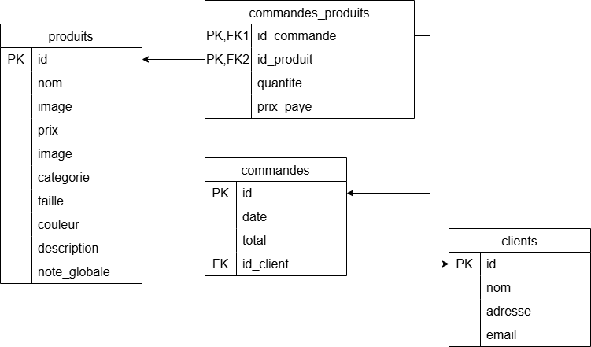

On a également des boutons qui proposent des actions:
1. cliquer sur un produit: Montrer (read)
2. le plus et le moins pour la quantité: UPDATE sur la quantité
3. l'icône de poubelle: DELETE d'un article dans le panier
4. "add to cart", pour INSERT une ligne de commande.