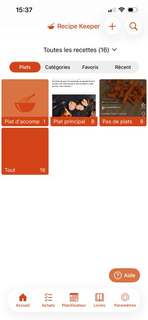
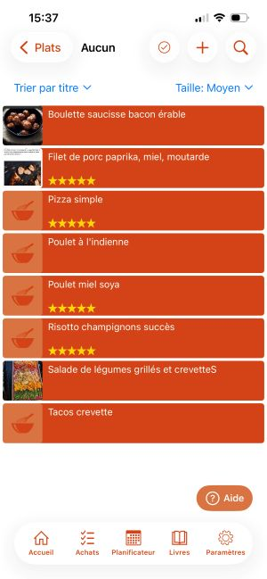
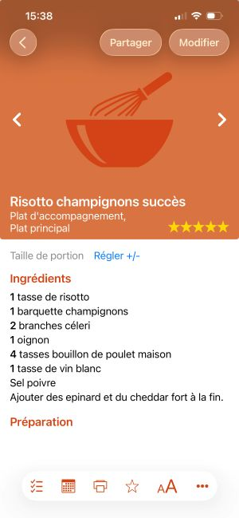
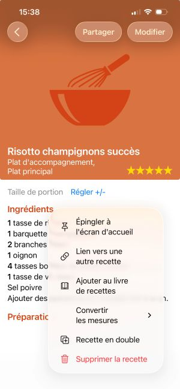
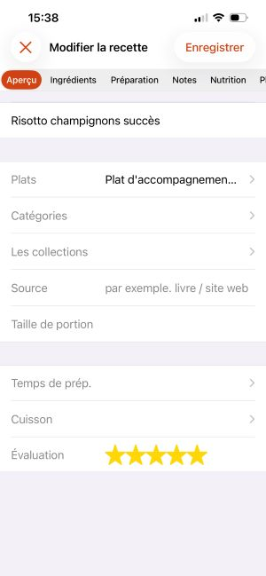
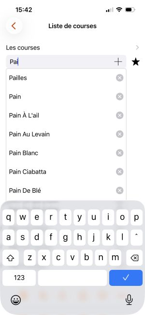
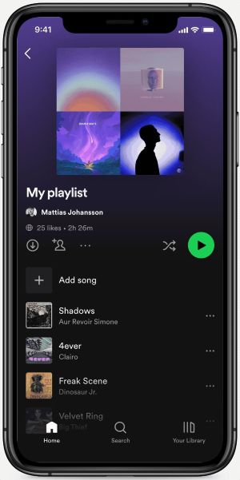
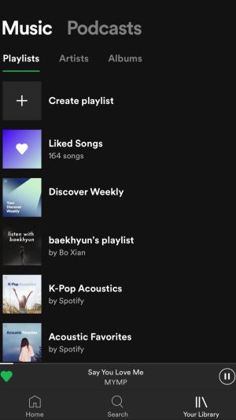
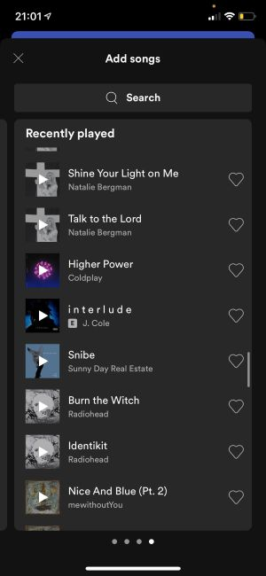

# Exercice 1

Voici quelques images de l'application "Recipe keeper" dans laquelle j'ai pris quelques impressions d'écrans. Faire un MRD partiel des informations 

    

    

 

# Exercice 2

Voici quelques échantillons d'images d'une version simplifiée de Spotify (images générées par IA):

     

 
 
