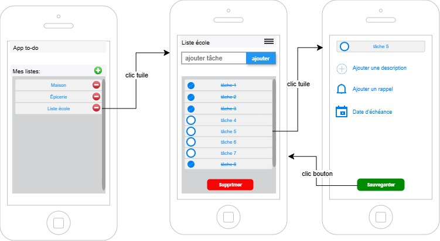

# Construire une maquette

- Une maquette est un visuel qui montre comment seront organisés les éléments (UI) dans l'application qu'on développe. Ça aide à visualiser l'expérience utilisateur (UX). C'est aussi un bon point de départ pour savoir quelles données devront être recueillies, les actions que le code devra faire (en BD aussi).
- Sans maquette, on code à l'aveugle et on risque d'oublier des éléments.
- Ce n'est pas nécessaire de choisir la palette de couleur ou la police d'écriture à cette étape... Une maquette peut être un dessin papier ou un croquis avec un outil de votre choix:
  
  - Draw.io (ajouter les outils de dessin de maquette : Plus de formes -> Logiciel -> Maquette. Naviguer pour en trouver d'autres au besoin)
  - Balsamiq (14 jours d'essai gratuit)
  - Figma
  - etc.

> Pour l'examen, ce sera draw.io ou à la main. Par contre pour le travail pratique, ce sera à votre discrétion.

## Étapes pour créer une maquette à partir de zéro

### Étape 1 : Comprendre le besoin

Se poser des questions :

- Quel est le but de l’application?
- Qui va l’utiliser?
- Quelles actions sont possibles?

Par exemple :
Application de tâches (todo):

- Ajouter une tâche
- Supprimer une tâche
- Voir la liste

### Étape 2 : Identifier les écrans

Chaque application contient des écrans. Par exemple :

- Écran de connexion
- Écran principal
- Écran détail

### Étape 3 : Dessiner les éléments principaux 

- Placer les écrans, les champs, les boutons
- Ne pas penser aux détails du design. Garder le focus sur l'emplacement, le remplissage des espaces vides, la facilité de navigation. Il n'est pas nécessaire à cette étape de penser au match de couleur, aux arrondi des coins ou aux effets de couleur ou d'ombrage.
- Se concentrer sur la logique et s'assurer que chaque action a une manière d'être réalisée

### Étape 4 : Penser aux interactions

Se poser les questions :

- Que se passe-t-il quand on clique? (mène à une autre fenêtre?)
- Que se passe-t-il si erreur?

# Exemple app TODO

### Étape 1
- But: ajouter rapidement des tâches dans des listes distinctes (qu'on peut créer aussi). Pouvoir cocher les tâches faites, pouvoir supprimer les tâches faites également.
- Pour une tâche, pouvoir ajouter une description précise, un rappel ou une date d'échéance.

### Étape 2
- écran d'ajout et présentation des listes
- écran des tâches dans une liste
- écran d'un ajout de détails de tâche
  
### Étape 3 et 4:

Exemple d'ajout d'élément à cette image:
- Ajouter des flèches vers des messages d'erreur si on tente d'entrer une tâche pas de nom
- Ajouter un calendrier si on clique sur "date d'échéance" pour permettre de choisir une date.
- etc.

