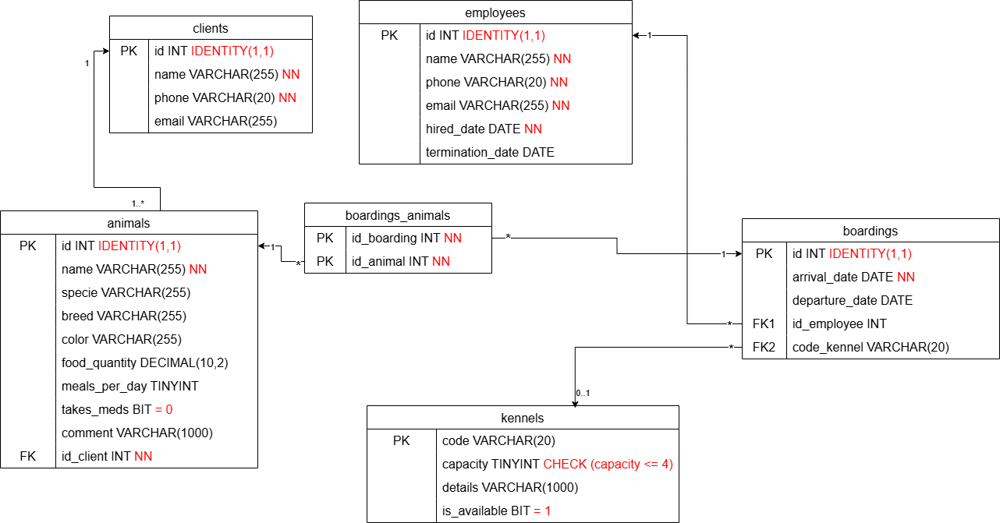

# Exercice

Créer une maquette pour illustrer l'appli de pensions d'animaux. Cette appli sera placée sur les postes fixes de l'animalerie (des écrans de PC). Faire la maquette restreinte seulement à l'utilisation faite par les employés non-admin.

Rappel:

Les éléments qui doivent minimalement être possibles de faire dans votre maquette:

- Créer/modifier une pension
- Ajouter/modifier un animal
- Mettre l'emphase sur la vue d'ensemble des rendez-vous

Inspirez-vous de modèles en ligne, si nécessaire:
- [petKeeper](https://demo.petkeeper.app/occupancy) (Demo-123 si vous devez vous connecter)
- [Animalo](https://www.animalo.com/fr)
- AI quelconque