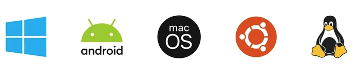

# Le développement logiciel

Supposons que vous vouliez développer un petit logiciel ou une application mobile... Par où commencer?  

Lancez vos suggestions!

 
<a href="https://www.flaticon.com/free-icons/think" title="think icons">Think icons created by Freepik - Flaticon</a>

## Le système d'information et le logiciel

### Un **système d'information** c'est:

- un ensemble de composants interdépendants qui collectent, traitent, stockent et fournissent en sortie les informations nécessaires pour mener à bien des tâches dans l’organisation.
- Le SI inclut toujours les personnes qui opèrent le système et qui exécutent des tâches
    - lorsque tu recherches des articles dans Amazon, tu fais partie du SI (dans la partie qui entre de l’information et qui consomme une sortie).
    - Lorsque tu envoies une photo sur SnapChat, tu fais aussi partie du SI  (dans la partie où tu sélectionnes une discussion, tu prends la photo et tu l’envoies).

### Une **organisation** c'est :
- un système qui évolue pour s’adapter/survivre
- elle est constituée de parties (composantes), vues elles aussi comme des organisations: divisions, départements, directions, équipes, etc.
- elle a un but et génère des produits ou des services pour des bénéficiaires (clients, autres organisations)
- ses activités sont réalisées par des acteurs (personnes, groupes/équipes, machines, etc.)
- les activités de l’organisation sont modélisées comme des processus réalisés par des acteurs internes

### Un **logiciel** c'est:

- une collection de données et d’instructions qui indique à un ordinateur comment fonctionner pour exécuter une tâche
    - Parfois le terme « app » ou « appli » est utilisé en tant que raccourci

- Il existe pour répondre au besoin d’un client ou pour trouver une solution à un problème

### Logiciel vs SI: 

Le système d’information (SI) :
- Inclut les personnes et les procédures manuelles
- Est généralement composé de plusieurs composants (serveur, client, acteurs, etc.)

Une application ou un logiciel:
- réfère généralement au logiciel qui est installé sur un appareil
- Les logiciels sont créés et livrés à la demande d'un client ou sur l'initiative du producteur, et mis sur le marché, parfois gratuitement
- Créer un logiciel est un travail intellectuel qui prend du temps
- La création de logiciels est souvent le fait d'une équipe, qui suit une démarche logique et planifiée en vue d'obtenir un produit de bonne qualité dans les meilleurs délais
- Lorsque l’on se procure un ordinateur, on met souvent l’emphase sur le matériel, mais c’est avant tout les logiciels qui donnent à l’ordinateur sa valeur ajoutée
- On a une variété d'appareils tous connectés au même SI:

 

## Les types de logiciels:

### Logiciels applicatifs (Applications)
Logiciel servant à répondre à un besoin spécifique au-delà des opérations de base de l’ordinateur. Il y a beaucoup de types d’applications, car il y a une infinité de tâches que ceux-ci peuvent accomplir.  

Il en existe actuellement plus de 4 millions sur Google play et App store seulement.

### Logiciels système: 

Logiciel servant à faire de la gestion du matériel informatique. Il sert aussi de plateforme pour exécuter les applications. Par exemple:
- Système d’exploitation : gère les ressources et sert des couches d’abstraction pour les applications
- Pilote de périphérique : opère et contrôle un périphérique
- Utilitaire : assiste l’utilisateur à la maintenance des ordinateurs (gestion de réseau, backup, etc.)

### Logiciels malveillants:

Logiciel développé pour endommager et perturber les ordinateurs.Évidemment, ce sont des logiciels indésirables. Ces logiciels sont utilisés pour:
- spoofing (usurpation), 
- falsification, 
- divulgation d’info, 
- vol d’information, 
- augmentation de privilèges, 
- déni de service
- etc.

## Hardware, software, firmware

- Hardware est le matériel
- Firmware est le programme intégré dans le matériel
    - Sur un PC, c’est le BIOS (Basic Input/Output System ) ou UEFI (Unified Extensible Firmware Interface)
    - Francisé avec Microgiciel
    - Le programme sur un Arduino ou PIC
Software est le logiciel typique (OS ou applicatif)

>  Note: L'UEFI a largement remplacé le BIOS en raison de ses fonctionnalités étendues, de sa compatibilité avec les technologies modernes et de ses capacités de sécurité améliorées. Cependant, de nombreux gens utilisent encore le terme "BIOS" de manière générique pour désigner le firmware de démarrage, même si techniquement ils se réfèrent à l'UEFI.

## Développement de logiciel

- Le développement de logiciel est une activité qui consiste fondamentalement à créer des logiciels, mais aussi faire une mise au point, l’amélioration et même la transformation des logiciels
- Selon l’envergure du logiciel, celui-ci peut être développé par une personne seule, une petite équipe ou un ensemble d’équipes coordonnées
- Le développement de gros logiciels est source de défis tant au niveau de la conception en soi et de la coordination des équipes
    - L’analyse d’un gros logiciel sort du cadre du cours

Quelques statistiques:

**En 1995**:
Une étude du Standish Group dressait un tableau accablant de la conduite des projets informatiques. Reposant sur un échantillon représentatif de 365 entreprises, totalisant 8 380 applications, cette étude établissait que :
- 16,2% seulement des projets étaient conformes aux prévisions initiales.
- 52,7% avaient subi des dépassements en coût et délai d'un facteur 2 à 3 avec diminution du nombre des fonctions offertes.
Ex: Le fameux « Dossier santé informatisé »
- 31,1% ont été purement abandonnés durant leur développement.
Pensez seulement au registre des armes à feu, système de paye Phoenix, …

Source: https://www.standishgroup.com/sample_research_files/chaos_report_1994.pdf

**En 2020**:
Dans l’étude de 2020 du Standish Group les chiffres suivants en sont sortis. Les méthodes cascade et agile seront survolées plus tard.

| Méthode/ Statut   | Agile   | Cascade   |
|-------------|-------------|-------------|
| Succès    | 42% | 13%  |
| Défis    | 47% | 59%  |
| Abandon    | 11%  | 28% |

Source: https://vitalitychicago.com/blog/agile-projects-are-more-successful-traditional-projects/

### Facteurs de réussite et d'échec:

Les 5 principaux facteurs de **réussite** d’un projet informatique:
1. Implication des utilisateurs 
2. Soutien à la direction générale
3. Énoncé clair des exigences
4. Bonne planification
5. Attentes réalistes

Les 5 principaux indicateurs pour les projets IT **menacés**: 
1. Manque d’information de l’utilisateur
2. Requis et spécifications incomplètes
3. Modification des requis et spécifications
4. Manque de soutien de la direction générale
5. Incompétence technique

Les principaux facteurs des projets IT **ratés**:
1. Requis incomplets
2. Manque de participation des utilisateurs
3. Manque de ressource
4. Attentes irréalistes
5. Manque de soutien de la direction
6. Modification des requis et spécifications
7. Manque de planification
8. Le besoin n’est plus pertinent
9. Manque de gestion informatique
10. Analphabétisme technique

### Leçon apprises:

- L'examen des causes de succès et d'échec est instructif
- La plupart des échecs proviennent non pas de l'informatique, mais de la maîtrise d'ouvrage
    - Une personne morale (entreprise, direction, etc.), une entité de l'organisation
- Pour ces raisons, le développement de logiciels dans un contexte professionnel suit souvent des règles strictes encadrant la conception et permettant le travail en groupe et la maintenance du code
- Ainsi, une nouvelle discipline est née : **le génie logiciel**
- Quelques [bugs](https://www.topito.com/top-10-des-erreurs-de-programmations-les-plus-couteuses-de-lhistoire_) et [erreurs coûteuses](https://www.rocketprojet.com/29-bugs-informatiques-catastrophe/) de l'histoire 

### [Quiz!](quiz1.md)

## Références:
- Comment trouver une idée d'application et les étapes à suivre:
https://codewithchris.com/how-to-make-iphone-apps-with-no-programming-experience/#1-generate-an-app-idea 

- Définition d'un SI: Systems Analysis and Design in a Changing World-Course Technology (2015). Page 4

- Les cyberattaques courantes: https://www.cisco.com/c/fr_ca/products/security/common-cyberattacks.html#~comment-fonctionnent-les-cyberattaques 

- Bugs: https://www.topito.com/top-10-des-erreurs-de-programmations-les-plus-couteuses-de-lhistoire_

- Erreurs coûteuses : https://www.rocketprojet.com/29-bugs-informatiques-catastrophe/ 