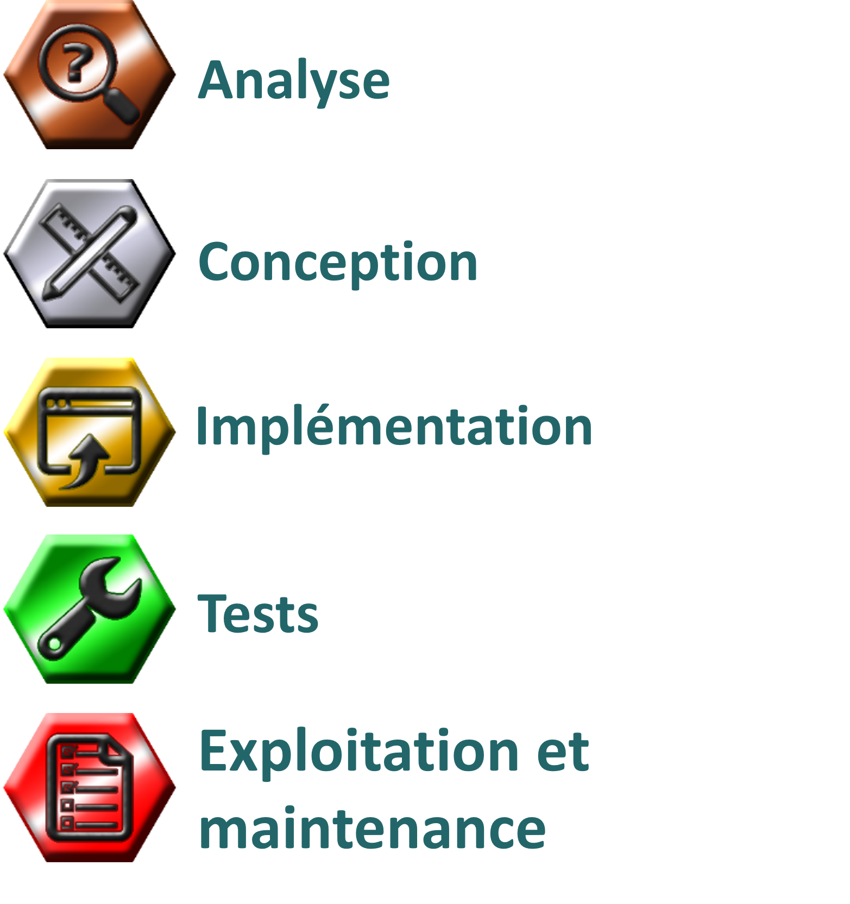
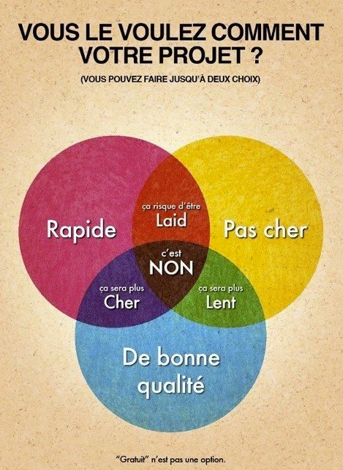
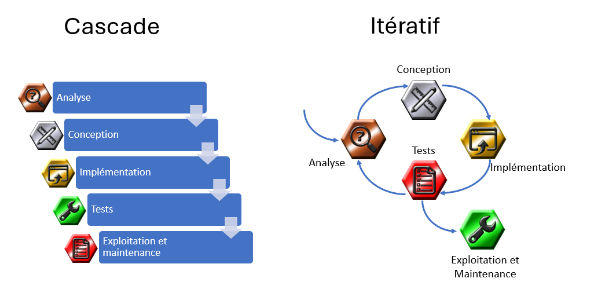
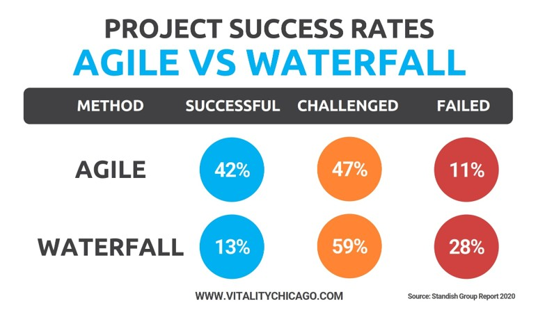
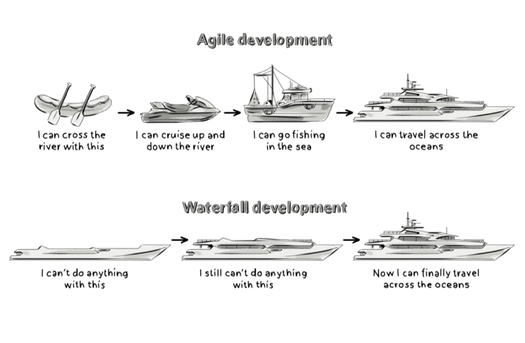

# Modèles de développement

### Modèle général:

- Peu importe le modèle de développement utilisé, ils ont tous des phases similaires
- L’enchaînement des phases diffère entre les modèles surtout au niveau du moment d’appliquer les phases
- Je vous présente deux modèles soit les modèles en cascade et itératif (précisément, Agile)

- La notion de cycle de vie englobe toutes les étapes et activités nécessaires pour arriver à produire et maintenir le logiciel: Étapes, buts intermédiaires, biens livrables, vérification et validation.

- Ce type de cheminement est essentiel pour le développement d'applications
- Enjeux principaux qui guident de tels choix: 
    - réduire le risque d'erreurs,
    - améliorer la qualité,
    - maîtriser les délais,
    - éviter les dépassements dans les budgets.

### Coût - délai - qualité

 
 

## Modèle en cascade (Waterfall)

La méthode cascade est un modèle linéaire et séquentiel où chaque phase du projet (analyse, conception, développement, tests, déploiement) doit être complétée avant de passer à la suivante. Elle est structurée et prévisible, avec un plan détaillé dès le début. Toute modification en cours de développement est coûteuse.

Caractéristiques :
- Phases fixes et non flexibles.
- Un processus rigide avec peu de retour en arrière.
- Convient aux projets avec des exigences bien définies dès le départ.
- Pas de réévaluation après chaque phase.

Exemples: 
- Le développement d'un logiciel embarqué pour un avion ou un satellite.
    - Les spécifications techniques et les exigences de sécurité sont très strictes, et les changements en cours de développement peuvent être coûteux et risqués. Le projet suit un processus séquentiel clair avec des validations après chaque phase.
- Logiciels de contrôle pour des machines de production dans une usine
    - Les spécifications techniques des machines et du logiciel sont définies avant la production, et il y a peu de flexibilité pour apporter des modifications pendant le processus de développement.
- Un système de gestion pour un hôpital, où les exigences légales et réglementaires (par exemple, la confidentialité des données des patients) sont strictes et doivent être clairement définies et suivies dès le début.
    - Les exigences légales et de conformité sont bien définies au départ, et il est difficile de changer les processus une fois le projet lancé.

|Avantages                | Inconvénients                    | 
|------------------------|-----------------------------------|
|Une planification claire et un design simple     | Une structure rigide            | 
|Un périmètre clairement défini          | Pas de place pour les incertitudes                  |
|Une projection des coûts plus précise         | Une insatisfaction potentielle du client                    |
|Des indicateurs de progression clairs          | Des tests en fin de processus                    |
|Des rôles d’équipe définis          | Des exigences claires nécessaires dès les premières étapes           | 
|Une charge partagée             | Priorité donnée à la documentation au détriment de la construction            | 
| | |

Détails [ici](https://www.servicenow.com/fr/products/strategic-portfolio-management/what-is-agile-vs-waterfall.html#:~:text=La%20m%C3%A9thode%20Agile%20repose%20sur,plusieurs%20t%C3%A2ches%20en%20m%C3%AAme%20temps.&text=Les%20it%C3%A9rations%20Agile%20apportent%20de,apporter%20des%20am%C3%A9liorations%20aux%20produits.) 

 
 

## Modèle itératif

La méthode itérative divise le projet en petites phases ou itérations, chacune livrant une version partielle du produit. Les retours des utilisateurs ou les tests sont intégrés au fil du développement, permettant des ajustements réguliers. À chaque itération, le produit devient de plus en plus complet et fonctionnel.

Caractéristiques :
- Développement par étapes (itérations).
- Feedback constant et ajustement tout au long du processus.
- Flexibilité pour intégrer des changements.
- Convient aux projets avec des exigences évolutives.

Exemple:

- Création d'une plateforme de commerce en ligne (e-commerce).
    -  Les besoins des utilisateurs peuvent évoluer au fur et à mesure que des retours sont reçus pendant le développement. L'équipe peut ajuster les fonctionnalités et l'interface utilisateur en fonction des retours des utilisateurs après chaque itération, permettant ainsi d'optimiser l'expérience utilisateur et les fonctionnalités.
- Développement d'un jeu vidéo avec des versions alpha et bêta.
    - Les retours des joueurs sur les premières versions permettent d'ajuster les mécaniques de jeu, les graphismes et les fonctionnalités. Chaque version itérative est testée et améliorée avant la suivante, ce qui permet de corriger les erreurs et d'ajouter de nouvelles fonctionnalités de manière continue.
- Logiciel de gestion interne pour une entreprise qui évolue fréquemment en fonction des nouvelles régulations ou des exigences spécifiques du marché.
    - Les besoins de l'entreprise peuvent changer au cours du développement en fonction des nouvelles exigences ou priorités. Une approche itérative permet d’adapter le logiciel à ces changements sans perturber le flux de travail global.
- Développement d'un produit IoT (Internet of Things) innovant, comme un dispositif de santé connecté.
    - Les premières itérations permettent de tester rapidement un prototype, d'obtenir des retours des utilisateurs ou des experts, et de l'améliorer progressivement en fonction des tests et des retours obtenus à chaque itération.

La méthode cascade est idéale pour des projets bien définis et peu susceptibles d’évoluer, tandis que la méthode itérative est préférable pour des projets dynamiques et sujets à des changements fréquents, offrant plus de flexibilité et de réactivité face aux retours d’expérience. Le modèle le plus populaire de nos jours pour la plupart des projets!

| Critère                | Cascade                           | Itératif                       |
|------------------------|-----------------------------------|--------------------------------|
| **Approche**           | Linéaire, séquentielle            | Par itérations, flexible       |
| **Planification**      | Plan détaillé en début de projet  | Planification évolutive, ajustée au fur et à mesure |
| **Flexibilité**        | Faible, difficile à changer en cours de route | Haute, les changements sont intégrés régulièrement |
| **Révision et feedback**| Aucune révision après chaque phase | Révisions régulières après chaque itération |
| **Risques**            | Risque élevé de non-conformité avec les attentes si des erreurs sont faites au début | Risque plus faible, les erreurs sont rapidement identifiées et corrigées |
| | |

 
 

 
 

### Agile

La méthode agile base ses fondements sur la méthode itérative, mais va plus loin. Agile est une philosophie, alors que le processur itératif est une technique. Agile inclut souvent un cadre spécifique comme Scrum, avec des rôles définis (comme Scrum Master, Product Owner) et des pratiques comme les sprints, les rétrospectives, et les revues de sprint.

|Avantages                | Inconvénients                    | 
|------------------------|-----------------------------------|
|Planification fiable             | Niveau élevé d'implication des clients nécessaire            | 
|Autonomie de l'équipe           | Engagement total de l'équipe                  |
|Flexibilité         | Temps parfois insuffisant pour prendre en charge tous les livrables                    |
|Communication plus efficace           | Gouvernance complète impossible                    |
|Attention accrue portée sur la valeur commerciale            | Documentation peu fournie            | 
|Orientation client améliorée             | Adoption culturelle requise            | 
| | |

Détails [ici](https://www.servicenow.com/fr/products/strategic-portfolio-management/what-is-agile-vs-waterfall.html#:~:text=La%20m%C3%A9thode%20Agile%20repose%20sur,plusieurs%20t%C3%A2ches%20en%20m%C3%AAme%20temps.&text=Les%20it%C3%A9rations%20Agile%20apportent%20de,apporter%20des%20am%C3%A9liorations%20aux%20produits.) 

## Résumé des modèles

## Autres ressources:

- Quand utiliser Cascade vs Agile (10 min, anglais): https://www.youtube.com/watch?v=mepINtMD1aE 

- Agile vs Waterfall: https://clearcode.cc/blog/agile-vs-waterfall-method/

