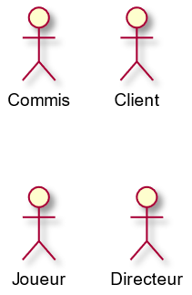
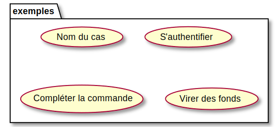
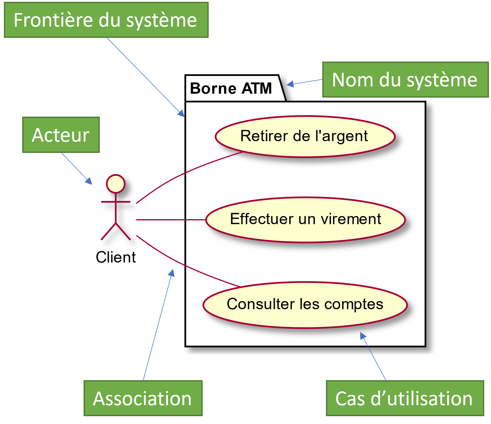
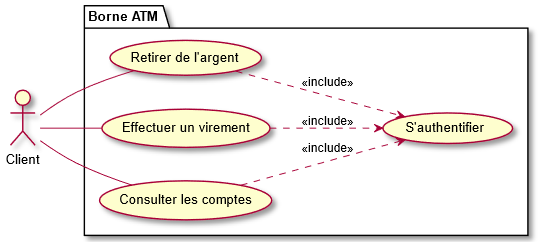
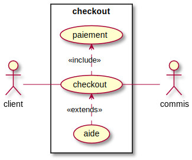
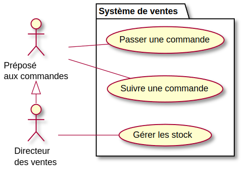
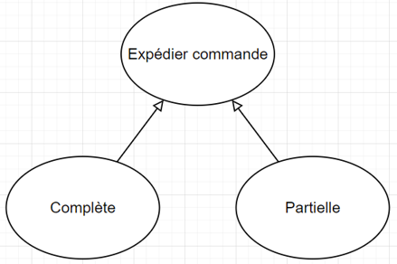

# Les cas d'utilisation

Les cas d'utilisation permettent d'exprimer le besoin des utilisateurs d'un système, ils sont donc une vision orientée-utilisateur de ce besoin au contraire d'une vision informatique.

En tout temps, garder une idée en tête: NE PAS remplir des case pour remplir des cases... remplir des cases pour être le plus clair possible et réutiliser le schéma plus tard.

Lorsque la tâche de faire le développement a été attribuée, que le client est rencontré une première fois et qu'on a une idée globale du projet, on peut commencer à décortiquer les éléments.

## Quelques définitions

**Acteur**: un acteur est un utilisateur d'un système. Il peut être principal ou secondaire. On ne met pas de nom personnalisé à un acteur, c'est une entité: un client, un administrateur, un gestionnaire, un employé, un système... Mais pas un nom précis de personne.

**Cas d'utilisation** : un cas d’utilisation (CU) est une **action** pouvant être exécutée par un acteur du système. (Retirer de l'argent, Consulter un compte, s'authentifier, passer une commande, etc.)

**Système**: un système est considéré comme un composant non-humain informatique ou non (logiciel, site web, gouvernement, etc.)

# Trouver les cas d'utilisation d'une situation

Reprenons la cliente qui crée des gâteaux. Supposons qu'on l'ait contactée et qu'on ait analysé ses besoins. Le portrait global est celui-ci: 

Elle souhaite faire un site web responsive (pas d'application mobile finalement) pour que les client puissent voir ses créations passées (accueil avec plusieurs tuiles qui prennent la majorité de l'espace) et cliquer dessus pour voir les ingrédients, les formats disponibles et les prix. Elle veut pouvoir ajuster facilement les images et les textes de son site via une fonctionnalité d'administrateur. Les clients pourront aussi choisir de passer une commande quand ils auront cliqué sur un gâteau. Quand ils veulent réserver, ils cliquent sur un bouton qui les amène vers une page où ils ont quelques champs à compléter (comme le nom, numéro de téléphone, mail, quantité, date, etc.). Il pourront aussi choisir un bouton "Gâteau personnalisé" qui les amènera vers la même page d'information, sans que les champs de choix de gâteau soient remplis dans ce cas.

Lorsque le client confirme la commande, un courriel est envoyé à la propriétaire.

1. Trouver le ou les acteurs dans cette situation
2. Quel est le système?
3. Trouver des cas d'utilisation possible pour les acteurs

## Exercice en classe:

Trouvez les acteurs et quelques cas d'utilisation pour:

- Omnivox 
- L'application Discord
- L'application Netflix
- Le site fictif de réservation de gâteau en ligne 

# Diagramme des cas d'utilisation 

Pour dresser un portrait global, mais simple de la situation, on peut faire un diagramme des cas d'utilisation. Voici quelques symboles à utiliser:

## Acteur
- Un acteur est l’utilisateur qui interagit avec le système
- Il doit être une personne externe, un processus ou une chose qui produit et consomme des données
- On le représente par un bonhomme avec son rôle inscrit en dessous comme montré ci-contre

## Cas d'utilisation

- Un cas d'utilisation est une unité cohérente représentant une fonctionnalité visible de l'extérieur. 
- Il réalise un service de bout en bout, avec un déclenchement, un déroulement et une fin, pour l'acteur qui l'initie. 
- Un cas d'utilisation se représente par une ellipse contenant le nom du cas débutant par un verbe à l'infinitif

## Diagramme des cas d'utilisation

Exemple simplifié de diagramme de cas d'utilisation modélisant une borne d'accès à une banque:
- La frontière du système est représentée par un cadre
- Le nom du système figure à l'intérieur du cadre, en haut
- Les acteurs sont à l'extérieur
- Les cas d'utilisation à l'intérieur

## Include

La relation d’inclusion oblige un cas d’utilisation à utiliser un autre cas
Pensez à un « #include » en C# ou C++. Si le fichier n’est pas présent, ça plante.
La relation est symbolisée par une flèche en tiret avec l’étiquette \<\<include>> 
Par exemple, l'accès aux informations d'un compte bancaire inclut nécessairement une phase d'authentification avec un identifiant et un mot de passe.  
Include = Obligation de faire l’action avant d’effectuer le cas d'utilisation

## Extends

La relation d’extension ajoute des possibilités de cas d’utilisation à partir d’un autre cas d'utilisation. La relation est symbolisée par une flèche en tiret avec l’étiquette <\<extends>> 
Par exemple, lorsque l’on veut accéder au checkout d’un panier, l’utilisateur peut accéder à l’aide

## Héritage

Relation entre les acteurs:

La seule relation possible entre deux acteurs est la généralisation (Héritage).
Dans ce cas-ci un directeur des ventes EST un préposé aux commandes mais est spécialisé dans le sens où il a également la possibilité de gérer les stocks.

De façon plus généralisée:

## Exercices

Ouvrir le document Word 03-Exercices.docx

