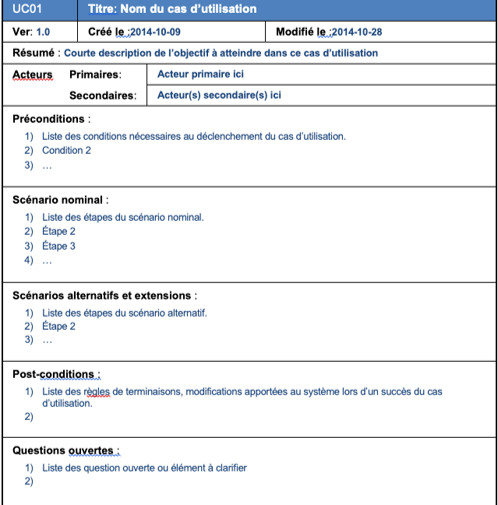
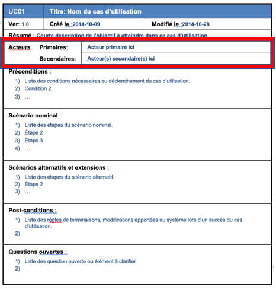
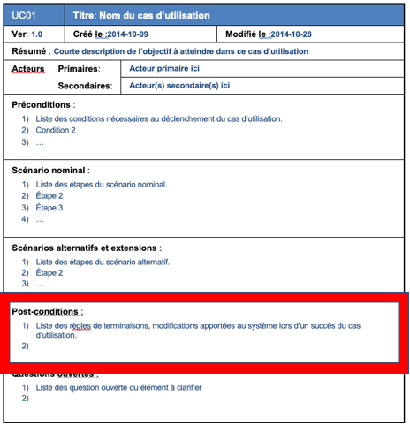
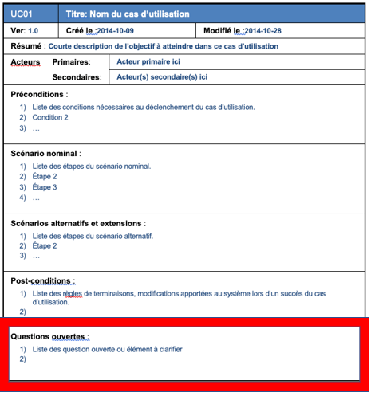

# Cas d'utilisation en détail

Le but de détailler un cas d'utilisation est de clarifier le déroulement de la fonctionnalité, de décrire la chronologie des actions qui devront être réalisées et d'identifier les parties redondantes pour en déduire des cas d’utilisation plus précis qui seront utilisées par inclusion, extension ou généralisation/spécialisation. 

En utilisant un gabarit comme celui proposé dans les notes de cours, on doit s'assurer de bien compléter les sections qui peuvent être complétées. Voici un aperçu:

- Décrire le déroulement des actions pour un cas d’utilisation peut vous paraître simple, mais c’est un travail qui demande beaucoup de réflexion et de questionnement. 
- On commence souvent par une première description, basée sur les informations que l’on a obtenues auprès du client et/ou des futurs utilisateurs. 
- On peut avoir plusieurs contraintes qui apparaissent en faisant cet exercice.
- Lors de la réalisation de cette première description, on découvre souvent des questions auxquels nous n’avons pas de réponse.

### Exemple:
Si une personne n’est pas encore « cliente » sur la boutique en ligne et qu’elle souhaite réaliser un achat :
- Doit-elle s’inscrire avant de commencer la procédure d’achat ?
- Peut-elle s’inscrire pendant la procédure d’achat, par exemple juste avant de régler?

Nous pouvons, bien sûr, avoir une idée sur la question. 
On se base d’ailleurs souvent sur des situations déjà vues ou vécues pour faire des propositions au client et aux utilisateurs

## Section acteurs

- Nom de l’acteur primaire ayant déclenché le cas d’utilisation.
- Il est également possible que des acteurs secondaires et des systèmes qui participent à ce cas d’utilisation.

Acteur primaire: 
- Qui va utiliser la fonctionnalité principale du système ? 
- Qui aura besoin du système pour réaliser les tâches qui lui sont dédiées ?

Acteurs secondaires:
- Qui est intéressé par les résultats retournés par le système ?
- Qui aura besoin de maintenir, administrer et laisser le système fonctionner ?

Systèmes externes:
- Quels sont les moyens physiques dont le système a besoin pour faire les traitements ? (systèmes externes)
- Avec quels systèmes le système interagit ? (systèmes initiant le contact avec le système et systèmes contactés par celui-ci)

## Section préconditions

- Il s’agit des conditions obligatoires au bon déroulement du cas d’utilisation. 
    - « Consulter le catalogue produit ». Dans le cas, le package « Authentification » est une pré-condition de « Consulter le catalogue produit ». 
- Les événements à l’origine du démarrage du cas d’utilisation 

## Section scénario nominal

- Il s’agit ici de décrire le déroulement idéal des actions, où tout va pour le mieux.
- Ne décrire que les actions principales qui déclenchent une autre action ou la fin du cas d’utilisation

## Section scénario alternatif

- Décrire les éventuelles étapes différentes liées aux choix de l’utilisateur, par exemple. C’est le cas des étapes liées à des conditions.
- On parlera de scénario d’exception lorsque une étape du déroulement pourrait être perturbée à cause d’un événement anormal.
    - Par exemple, lorsqu’une recherche de client ne trouve aucun client correspondant aux critères fournis.

On notera par 6.a) un scénario alternatif « a » débutant par le point « 6 » du scénario nominal.

Exemple:

6.L’utilisateur confirme vouloir retirer l’argent.

6.a) Le solde du client est insuffisant. On affiche un message à l’écran et retour au scénario nominal au numéro 5.

Le scénario alternatif donne un chemin pour les actions qui dérogent du scénario nominal dans le but de faire revenir au scénario de base ou bien le diriger vers un autre scénario ou un message d'erreur. Il n'est pas simple de couvrir tous les cas, c'est une des tâches qui survient souvent lors de la maintenance.

## Section post-condition

- Il nous indique un résultat tangible qui est vérifiable après l’arrêt du cas d’utilisation et qui pourra témoigner du bon fonctionnement.
- Cela pourrait être une information qui a été enregistrée dans une base de données ou dans un fichier, ou encore un message envoyé par mail, etc.

## Section question ouverte

- Liste de questions ouvertes ou éléments à clarifier avec le client.
- Il sera maintenant le rôle du client de trouver des réponses à ces interrogations du l’analyste-programmeur lors de la prochaine itération.
    - Le cas d’utilisation sera ainsi modifié afin de répondre à ces nouvelles contraintes.
