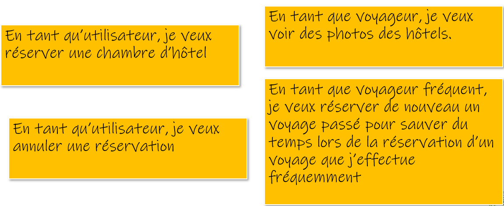
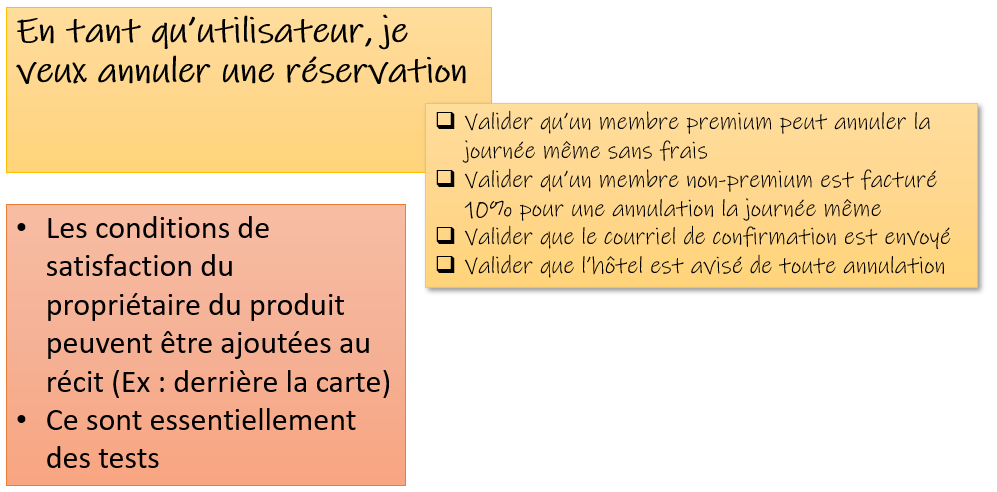
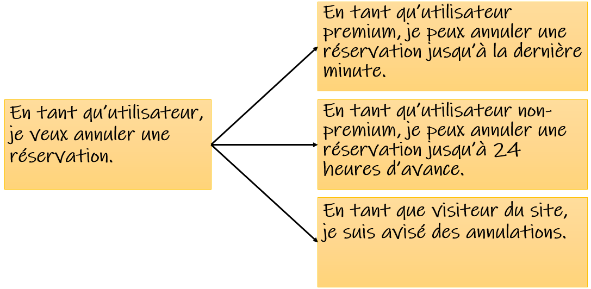
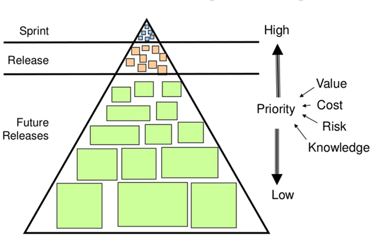
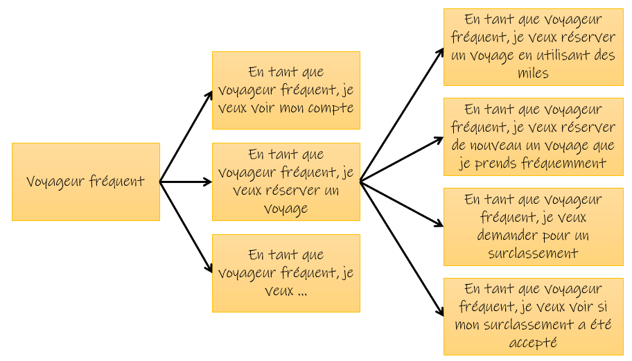

# Les récits d'utilisateurs (user stories)

## Introduction

Les récits d’utilisateurs (user stories) sont une autre technique agile de collecte des exigences fonctionnelles. Ils permettent de décrire ce qu’un utilisateur souhaite accomplir avec un système, en mettant l’accent sur la valeur apportée à l’utilisateur final. Contrairement aux spécifications traditionnelles, les user stories sont concises et compréhensibles par tous les acteurs du projet.

## Structure d’un récit d’utilisateur

Les récits d'utilisateurs sont souvent écrits sur de simples cartes épurées. Par exemple:

Un récit d’utilisateur suit souvent le format suivant :

"En tant que [type d'utilisateur], je veux [objectif] afin de [bénéfice]."

Exemple :

"En tant qu’administrateur du site, je veux pouvoir réinitialiser le mot de passe des utilisateurs afin qu’ils puissent récupérer leur compte en cas d’oubli."

## Les 3 C

### Cartes
- On souhaite mettre les user stories sur des cartes dans le but de se forcer à être concis (on ne peut pas écrire trop si on manque de place)

- Elles peuvent être physique ou électronique. Mais on a tendance à revenir au papier pour forcer à déchirer les cartes terminées ou dont on n'a plus besoin (en format électronique, on a tendance à tout garder pour rien) 

### Conversation

- Le but de garder les cartes épurées est de l'utiliser comme un support de **conversation**.

- Discussion entre l'équipe métier et l'équipe de développeur. On discute pour orienter les user stories, les découper, les préciser.

### Confirmation

- S'assurer que les critères de réussite de la user stories sont compris.

- Déterminer les critères d'acceptation pour terminer la user stories. Ceux-ci consistent en 

## Des détails en tant que conditions de satisfaction
En regardant de simples cartes comme celle ci-haut, ça manque de détail! Par exemple:

- On peut écrire les détails à l’endos de la carte (conditions d’acceptation)
- Les tests doivent être faits par le développeur, mais aussi par les clients 
- La liste derrière est comme le script de choses à montrer à l’utilisateur à la fin du sprint.

Plus la priorité est haute et qu'on s'approche du développement, on pourra mettre plus de détails:

**En tant qu’étudiant, je veux pouvoir consulter mes notes en ligne afin de suivre ma progression académique.**

- [] L’étudiant doit être capable de se connecter à son compte en utilisant ses identifiants (nom d’utilisateur, mot de passe). 
    - [] Si les informations sont incorrectes, un message d'erreur approprié doit être affiché.
    - [] Si les information sont correctes, l'étudiant est dirigé vers la page d'accueil du service.

## Des détails en tant que sous-récits

Une autre approche est de décortiquer le récit en sous-récits:

### Les 2 approches ne sont pas mutuellement exclusives.

# L'iceberg du backlog de produit

Les cartes s'écrivent lors d'ateliers d'écriture, avec les parties prenantes externes et l'équipe de développement. On fait un remue-méninges et on écrit le plus de récits possibles. On ne fait pas ça à tous les sprints. Le but ultime est de focusser sur la DISCUSSION plutôt que l'écriture. Tout le monde comprend les récits!

Ensuite, on peut prioriser les tâches à développer.

On n'investit aucune énergie sur les cartes qui sont plus bas. Naturellement, ces cartes vont remonter.
Les cartes du bas seront vagues et non détaillées. Ils auront du détail lorsque celle-ci seront monteront à la surface.

Quand les billets (cartes) remontent en priorisation, on peut itérer et préciser les récits:

## Le plus important:

## User stories vs use cases

| Use cases                                      | User Stories                               |
|-----------------------------------------------|--------------------------------------------|
| Donne une vue en contexte, une vision globale | Donne une vue par thème   |
| Vision permettant de voir l’ampleur du travail | Focus sur le contenu dans un sprint |
| Permet de voir le flow et les liens entre les utilisateurs et le système. | Décrit les rôles et les buts des utilisateurs |
| Donne une vue globale du système| Focus sur des fonctionnalités isolées. |
| Préconditions et postconditions     | Buts et des critères d’acceptation  |
| Plus axé sur la documentation      | Axé sur la conversation    |
| Adapté aux systèmes complexes | Adapté pour des fonctionnalités ciblées   |

# Références

Conférence de [Mike Cohn](https://www.youtube.com/watch?v=6q5-cVeNjCE) 

[Qu'est-ce qu'une user story et pourquoi est-ce essentiel](https://www.scrum.org/resources/blog/vlog-quest-ce-quune-user-story-et-pourquoi-est-ce-essentiel?)

# Et après?

Lorsque les user stories sont effectuées, que la rencontre a été faite, les étapes suivantes sont:

## Priorisation des user stories

- on peut utiliser un niveau de priorité haut, moyen, faible selon le budget et les besoins

## Découpage des user stories en tâches techniques 

- l'analyste en charge du projet crée les billets qu'il découpe en tâches techniques à afficher au tableau des tâches à faire par lui-même et les autres programmeurs s'il y en a. C'est à lui qu'incombe la tâche de déterminer le nombre d'heures à allouer à chaque tâche. C'est aussi lui qui informe l'équipe des échéances et deadlines.

- Parmi les tâches techniques à effectuer, on pourrait avoir, par exemple:
    - créer une page html
    - implémenter les divers boutons et champs à remplir (plusieurs billets possibles ici)
    - configurer la base de données
    - mettre en place l'API
    - faire le desing
    - etc.

## Tests et validation

- Chaque billet (tâche) implique qu'ensuite de faire des tests pour valider le fonctionnement et que quelqu'un d'autre fasse un code review.
- C'est ici qu'on roule les tests unitaires
- C'est ici qu'on peut déployer une version de test (mode intégration) pour que le client teste le projet.

## Déploiement et mise en production

- Après validation, les fonctionnalités développées peuvent être intégrées à la branche principale du code (par exemple, via un pull request). (attention, alerte à la paperasse!!)
- Elles sont ensuite déployées sur l’environnement de production pour que les utilisateurs finaux puissent les utiliser.
