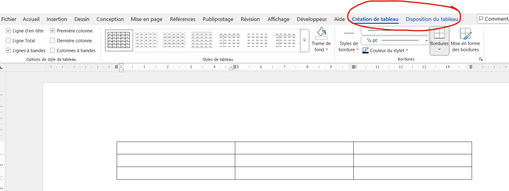
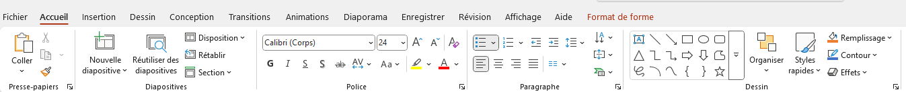
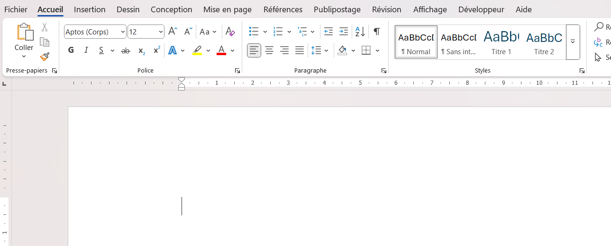
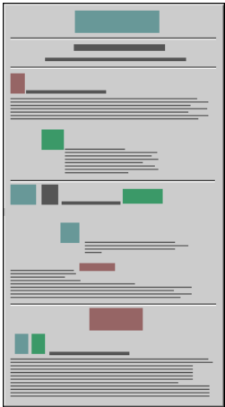
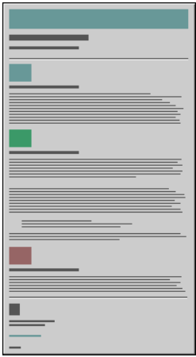
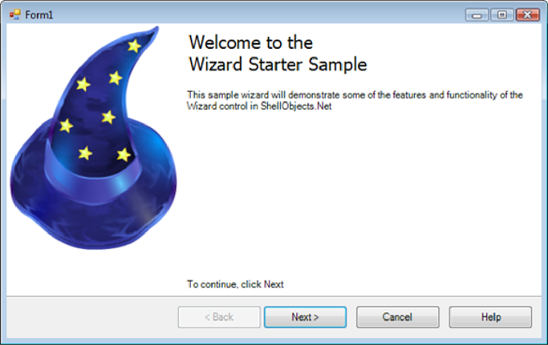
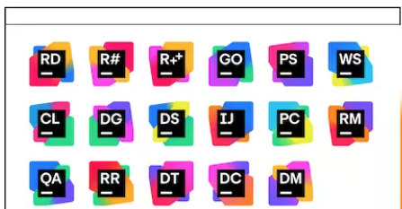
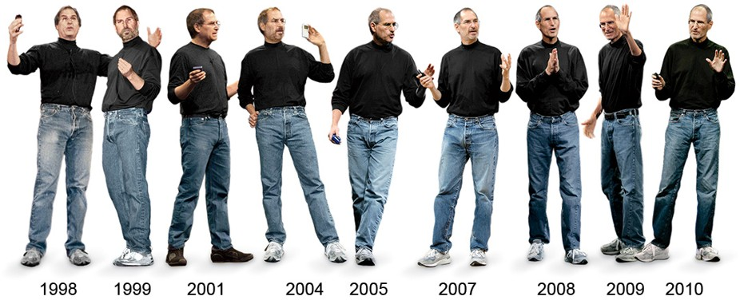
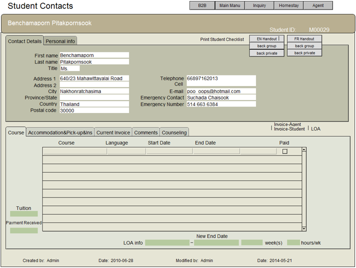
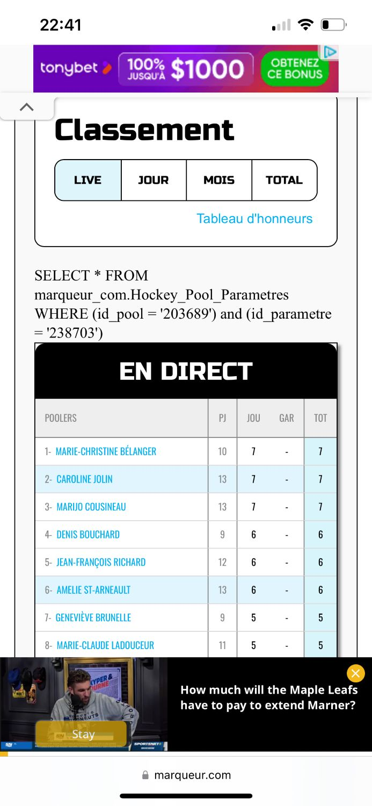

# Interface utilisateur

## L'interface, c'est important?
 
 

Est-ce important, vraiment? Pourquoi?

 
 
 
 
 
 
 
 
 
 
 
 
 
 
 
 

OUI, c'est important, c'est même CRUCIAL. Ça influence directement la satisfaction des utilisateurs et l'efficacité des systèmes. Une interface bien conçue facilite l'interaction, réduit les erreurs et améliore la productivité.

### Interface orientée utilisateur

- Parfois, nous ne nous attendons pas à ce que quelqu'un utilise certains produits de différentes manières.

- C'est pourquoi il est important de parler avec les utilisateurs finaux et aussi de les observer.

- Lorsque nous restons dans notre "bulle" à résoudre des problèmes par nous-mêmes, nous nous retrouvons avec un produit basé sur nos conventions limitées.

#### Exemple

“Usability is often a matter of life or death.” — Jakob Nielsen

En effet, cette citation est très importante pour beaucoup de produits. Si l’on prend le domaine médical, imaginez un appareil utilisé en salle d’opération qui a un écran tactile bien développé par des experts en UI.
Ça a été testé et approuvé par des médecins dans leur bureau

Question : Qu’est-ce qui pourrait arriver?

Pendant une opération où le temps est compté pour sauver une personne, le chirurgien a des gants… oups!

#### Autre exemple

C’est en partie un problème de conception qui aurait coûté la vie à l’acteur Anton Yelchin (Chekov dans le reboot de Star Trek)

Son Jeep Grand Cherokee a le type de levier de vitesses qui n’était pas standard
Le levier de vitesse revient toujours au centre et n’émettait aucun retour à l’utilisateur
Il est sorti du véhicule pensant l’avoir mis sur le « P » et s’est fait écraser.

[lien vers l'histoire](https://www.consumerreports.org/grand-cherokee/recalled-shifter-may-have-played-part-in-anton-yelchin-death/)

#### Autres catastrophes qui impliquent, entre autres, des mauvais UI 

- L'USS Vincennes a abattu un avion civil à cause de mauvais curseurs
- Three Mile Island est arrivé à cause d'une lumière sur la console
- Le vol 148 d'Air Inter s'est écrasé parce qu'un écran d'affichage était trop petit
- Le Herald of Free Enterprise a chaviré à cause d'une porte ouverte

#### Autre exemple moins catastrophique

- Snapchat Redesign (2018)
    - perte de popularité au profit d'Instagram Stories

- Twitter/X (achat en 2023 par Elon Musk)
    - Les changements radicaux et abruptes ont irrité les utilisateurs (Threads a eu plus de 100 millions d'inscriptions en quelques jour)

## Les règles d'or de Mandel

Dans le passé, les interface utilisateurs des logiciels étaient fait pour que l'utilisateur s'y conforme et s'adapte à lui. 

De nos jours, les interfaces doivent être adapté pour que l'utilisateur soit au CENTRE. On va voir plusieurs principes qui sont des sous-catégories des groupes suivants:
- Donner à l’utilisateur le contrôle de l’interface (10 sous-points)
- Réduire la charge cognitive de l’utilisateur (9 sous-points)
- Créer une interface qui est consistante (5 sous-points)

Regardons en détail:

## Donner à l’utilisateur le contrôle de l’interface

1. **Utiliser judicieusement les modes d’affichage (modeless)**
- L’utilisateur sait exactement dans quel mode il se retrouve, car il l’a activé
- Il y a une indication claire
    - Exemples : Bouton gras reste activé quand on l’active
    - Les palettes spéciales apparaissent dans Word pour les éléments particuliers, Le menu dans lequel on est est souligné et montre les fonctionnalités qui y sont rattachées seulement.

2. **Utilisation des techniques d’interaction appropriées (flexible)**
- Clavier, souris, écran tactile, vocale, etc.
    - Exemple : Sur un téléphone, l’utilisation d’une glissoire pour ajuster la brillance de l’écran
    - Possibilité de prendre la souris ou le clavier pour naviguer, même les commandes vocales.

3. **Autoriser les utilisateurs à perdre le focus (interruptible)**
    - Ex : L’utilisateur peut être interrompu par un appel téléphonique. Il doit être en mesure de continuer où il était rendu.

4. **Afficher du texte et des messages significatifs (Helpful)**
    - Exemple : Le champ exige un courriel, un message d’erreur affiche que le courriel doit avoir un format valide
    - Contre-exemple : « Une erreur est survenue »… oui, mais encore?
    [autres exemples](https://community.spiceworks.com/t/10-hilarious-error-messages-facepalm-worthy-computer-prompts-that-make-no-sense/629033)
    
5. **Fournir des actions immédiates et réversibles et du feedback (forgiving)**
    - Exemple : La commande « Annuler »
    - Contre-exemple: On clique quelque part et on ne voit pas le progrès ou on n'a pas l'impression que ça "travaille" derrière.

6. **Fournir des chemins et sorties qui ont du sens (navigable)**

    - On peut facilement prendre plusieurs chemins à partir du contexte d’utilisation

7. **Accommoder les utilisateurs avec différents niveaux d’habileté (accessible)**
    - Power user vs lambda user

8. **Faire une interface « transparente » (facilitative)**

9. **Permettre à l’utilisateur de personnaliser l’interface (preferences)**

10. **Permettre à l’utilisateur de manipuler les objets directement (interactive)**

## Réduire la charge cognitive de l’utilisateur 

1. **Réduire la mémoire à court terme (Souvenir)**
    - La règle générale c’est que l’humain a une mémoire de 7 ± 2 items
    - La séparation en bloc facilite la mémorisation

    

    - Autres exemples:
        - Gestionnaires de mots de passes
        - Auto-complétion dans les champs de formulaire

2. **Se fier à la reconnaissance et non au rappel (Reconnaissance)**

- Garder en mémoire les dernières recherches:

- Faire des listes cliquables plutôt que des champs à écrire.

3. **Fournir des indices visuels ou auditifs (Information)**
- Dans les interface d'application graphiques, il faut savoir en tout temps OÙ on est, QU'EST-CE qu'on fait et QUE PEUT-ON faire ensuite. 
    - Dans Word par exemple:

- C'est aussi dans cette optique qu'on entend des bruit de clavier quand on tape sur un smartphone, qu'il y a un bruit de photo ou un clic quand on ferme le téléphone.

4. **Fournir des valeurs par défaut, l’annulation et la reproduction (Pardon)**
    - Exemple : Commande « Annuler »
    - Les copies de sauvegarde automatiques (versions)

5. **Fournir des raccourcis d’interface (Fréquence)**
    - Les raccourcis claviers connus doivent fonctionner (ctrl + z, ctrl + c, ctrl + x, etc.)
    - On doit pouvoir guider l'utilisateur dans l'application via les contrôles de clavier: naviguons dans Word
    
6. **Promouvoir la syntaxe « un objet – une action » (Intuitif)**
    - Exemple : Quelles actions puis-je effectuer avec numéro de téléphone dans la liste de contact? Essayez-le

7. **Utiliser des métaphores du monde réel (Transfert)**
- Utiliser des images de la vie de tous les jours pour que l'action soit intuitive

8. **Utiliser la divulgation progressive (Contexte)**
    - Permettre à l’utilisateur d’avoir plus d’information au fil des clics
    - Exemple : Plusieurs menus dans Omnivox

9. **Promouvoir la clarté visuel (Organisation)**
- Ne pas trop en mettre, laisser l'espace épuré
- La surcharge d'information n'est pas plus informative...
- Organiser de manière uniforme. Voici un CONTRE-EXEMPLE d'une bonne organisation:

Et un meilleur exemple:

## Créer une interface qui est consistante

1. **Garder le même contexte que la tâche actuelle (Continuité)**
- On ne doit pas avoir à changer de fenêtre quand on complète une tâche. Si on a une tâche avec étapes successive, laisser les éléments le plus possible aux mêmes endroits.

2. **Maintenir une consistance à l’intérieur et au travers les produits (Expérience).**
- Chaque bouton, chaque écriture, chaque item permettant une action ne doit pas changer inutilement à l'intérieur de l'application
- Le comportement de chaque item ne change pas dans une même application
- Permettre aussi des éléments consistants d'une plateforme à l'autre (produits Apple, Jetbrains, Office, etc.)

3. **Garder les résultats d’interaction identique (Attente)**
    - Faites en sorte que les choses fonctionnent comme elles en ont l’air (interaction consistante)
    - et ont l'air de fonctionner (apparence consistante)
    - Contre-exemple: Cliquer sur un lien qui change de couleur en passant dessus, mais qui ne mène nulle part.
    
4. **Fournir un charme esthétique et intègre (Attitude)**
- Il ne faut pas que ça paraisse que le code ou le produit finit a été fait par des équipes distinctes qui ne se sont pas tellement parlé
- Utiliser une uniformité de couleurs, polices, titres, etc.

5. **Encourager l’exploration (Prédictible)**
- Les desing doivent donner envie à l'utilisateur d'explorer, d'essayer, et même de s'amuser avec les éléments de l'interface sans craindre les conséquences négatives.
- Par exemple, les tutoriels de jeux qui nous pointent où cliquer

## Règles générales

- Éviter les fautes d'orthographe
- Toujours le même alignement pour le même type de contrôle
    - Exemple : Les étiquettes toujours alignées à gauche ou à droite pour toute l’application
- Ordre de tabulation logique
- Infobulles avec une description pour chacune des actions
- Connaître les utilisateurs
- Optimiser les opérations
- Développer pour prévoir les erreurs

[Source: Règles d'or de Mandel](https://theomandel.com/resources/golden-rules-of-user-interface-design/)

[Source détaillée](https://theomandel.com/wp-content/uploads/2012/07/Mandel-GoldenRules.pdf)

# Section "Risque de blessures à la rétine"

Qu'est-ce qui cloche dans les exemples suivants? Quels principes ne sont pas respectés?

1. Application scolaire

2. [Quelques exemples ici](https://www.interaction-design.org/literature/article/bad-ui-design-examples)

3. [Site pas parfait!](https://slowlivingkitchen-com.translate.goog/how-to-dry-habanero-peppers/?_x_tr_sl=en&_x_tr_tl=fr&_x_tr_hl=fr&_x_tr_pto=rq#)

4. [WeTransfer](https://wetransfer.com/)

5. [Attention aux yeux!](https://www.nrao.edu/software/fitsview/)

6. [De belles fleurs](https://www.hemerocalles-isle.ca/cat-hem.php?var=B)

7. [Agence du revenu du Canada](https://www.canada.ca/fr/agence-revenu.html)

7. 

# Exercice
Trouver un site ou une application qui semble avoir un élément qui ne respecte pas les principes de base. Vous devrez le proposer au prochain cours et dire quel élément n’est pas respecté.
