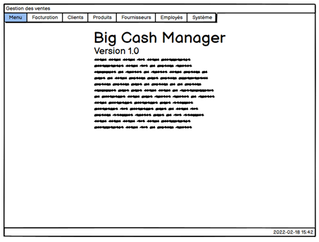
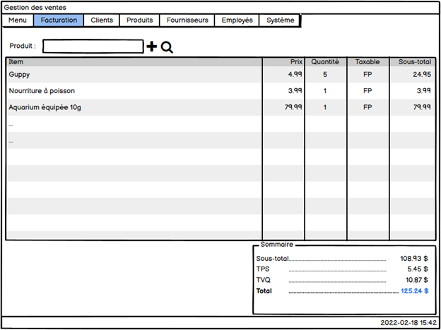

# Outil pour construire une maquette

Il existe plusieurs options pour créer des maquettes de logiciels (et d'autres spécialisés en sites web). Dans le cadre du cours, on utilisera Balsamiq wireframe pour créer nos maquettes.

L'application est gratuite et ne nécessite pas de compte si on la télécharge: https://balsamiq.com/wireframes/desktop/

Les palettes de couleur ne sont pas au centre dans cet outil. On réfléchit surtout à la disposition des éléments, leur interaction, leur réaction.

# Exercice

Utilisez l’outil Balsamiq pour créer la maquette à plusieurs pages suivante:

Dans un système de vente (application desktop) que vous devez développer, l’utilisateur doit pouvoir, entre autres, gérer des clients. C’est l’endroit où vous êtes rendu dans le développement de la maquette.

Lors du démarrage de l’application, les utilisateurs auront une maquette similaire à celle qui est montrée ci-dessous. Les utilisateurs sont des employés et non des clients.

1. Reproduire les 2 éléments suivants dans Balsamiq

2. Lorsque l’utilisateur cliquera sur « Clients », il aura une liste déroulante qui présentera les choix « Liste », « Nouveau », « Modification ».
a) Réalisez la maquette qui montrera à l’utilisateur l’interface lorsqu’il cliquera sur « Clients » à partir du menu principal. Réfléchir au comportement attendu, vous n’avez pas de précisions supplémentaire de la part du client.

b) Réalisez la maquette qui montrera à l’utilisateur l’interface lorsqu’il cliquera sur « Nouveau ».
1.	Le propriétaire du projet n’a pas mentionné les champs qui doivent être nécessaire pour un client. Selon vous, quelles sont les informations qui devraient être présentes?
2.	Faites une maquette avec l’information que vous jugez pertinente. N’oubliez pas de respecter les différentes règles vues en classe. N’hésitez pas à vous inspirer sur internet pour des modèles.
https://www.123formbuilder.com/fr/modeles-formulaires-gratuits/  

3. Ajuster votre projet pour faire en sorte que les boutons permettent de naviguer entre les fenêtres.