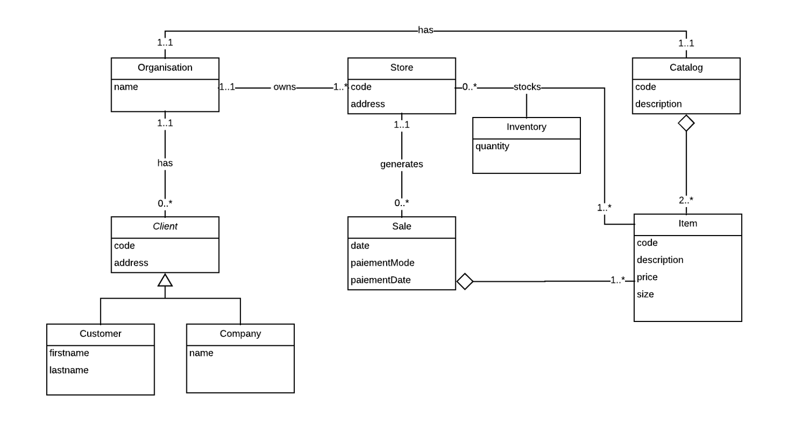
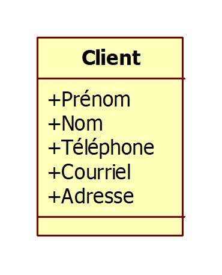
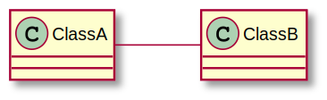
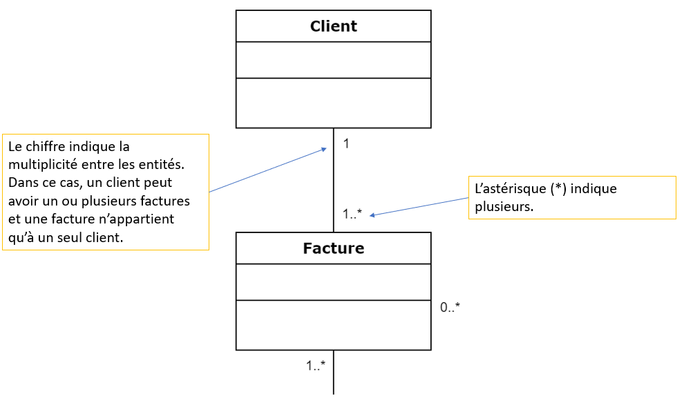
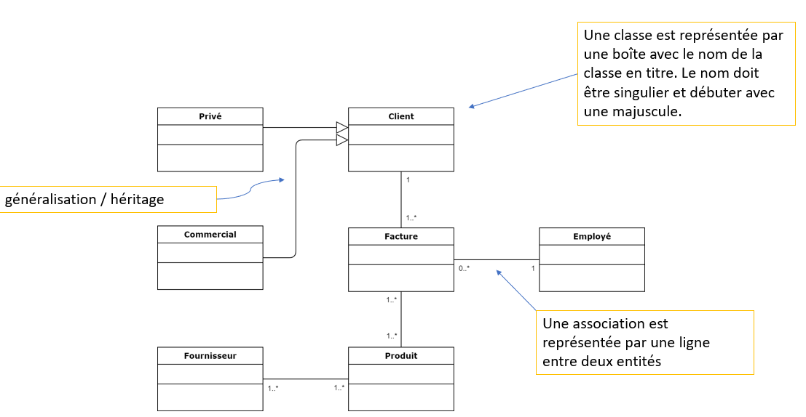
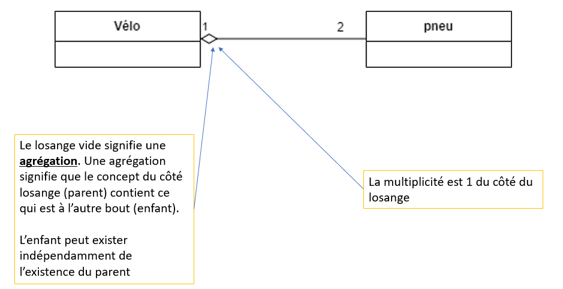
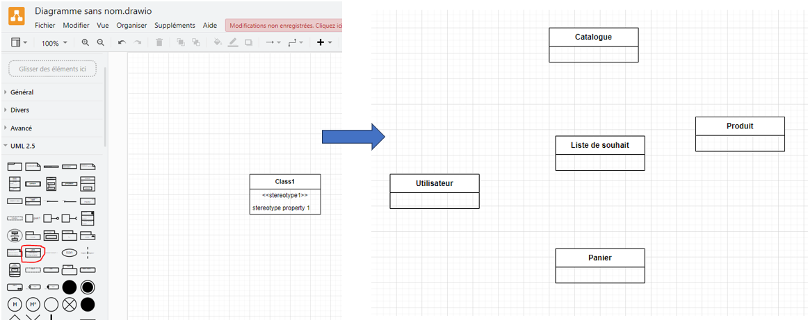
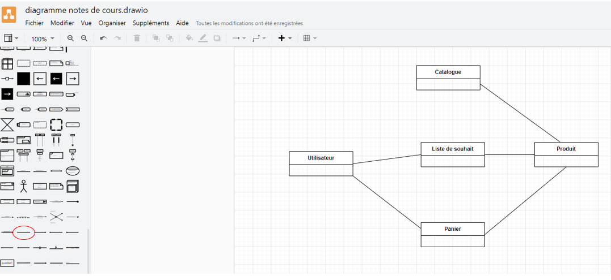
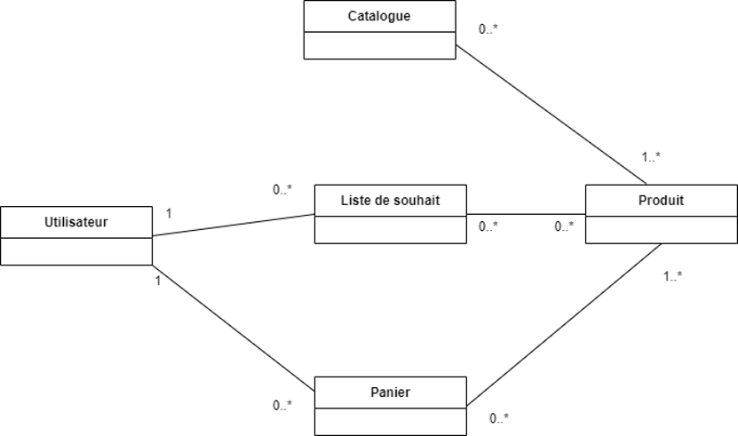

# Modèle du domaine

- Après une première analyse, vous connaissez
    - Les actions que les acteurs pourront effectuer dans un projet (Cas d’utilisation)
    - Le flow d'actions et les résultats attendus (user stories)
- Maintenant quelles sont les informations que l’on doit enregistrer?
- Comment doit-on les enregistrer?
- Comment doit-on les organiser pour faire un code fonctionnel?

Nous verrons dans les prochains cours comment organiser l’information en classes et en modèle de base de données

## Les objets et le modèle relationnel

- Les bases de données (BD) servent à la collecte et à l'enregistrement d'informations
- Avant de commencer à enregistrer de l’information, vous devez décider quoi enregistrer : c'est le domaine fonctionnel de votre projet


### SGBD

- Il existe différentes natures de BD (bases de données) ou plus précisément, de systèmes de gestion de bases de données (SGBD), présentant des caractéristiques différentes et adaptées à des contextes particuliers.

- En voici les principaux
    - SGBD relationnel : les données sont représentées dans différents tableaux pouvant être liés entre eux. Ex : Access, MySQL, MS SQL, Oracle, etc.
    - SGBD NoSQL (clé-valeur, orienté graphe, orienté document...) : les données sont organisées sous d’autres formes
        - clé-valeur : par exemple un dictionnaire qui à chaque mot (clé) associe une définition (valeur)
        - orienté graphe : associe à chaque élément les éléments liés (ex : les amis des amis d'une personne)

Dans les prochains cours, nous nous concentrerons sur les SGBD **relationnels**

- Nous allons organiser votre ensemble de données de manière structurée et qui plus est, en utilisant le vocabulaire du domaine fonctionnel de votre projet
- Pour cela, nous adoptons une approche orientée objet (AOO)
- Un objet représente un concept ou une entité du monde « réel »
- Le domaine fonctionnel est vu comme une composition de ces objets
- Afin de modéliser la composition d'objet de votre domaine fonctionnel
- Nous allons utiliser un langage spécifique et particulièrement bien adapté : **UML**

### UML

- UML signifie « Unified Modeling Language »
- Il s'agit d'un langage de modélisation graphique normalisé permettant de représenter les multiples aspects de la conception d'un système
- Il propose plusieurs types de diagrammes, chacun permettant de décrire les différentes facettes du système (fonctionnalité, architecture logique ou physique...)
- Nous avons déjà expérimenté avec les diagrammes de cas d’utilisation
- Bien qu'UML soit destiné à décrire l'organisation d'un système avec une  AOO, et non une base de données relationnelle, il peut servir de base à sa conception en modélisant le domaine fonctionnel (grâce au modèle du domaine et diagramme de classes)
- C'est cette démarche que nous allons voir maintenant


### Modèle du domaine

- C’est une représentation visuelle des classes conceptuelles ou des objets du monde réel dans un domaine donné
- Il est aussi nommé modèle conceptuel, modèle objet du domaine, modèle objet d’analyse ou encore diagramme de classes conceptuelles
- Il est constitué de classes conceptuelles, d’associations entre classes conceptuelles et d’attributs qui décrivent chacune des classes conceptuelles

#### Questions
1. Qu’est-ce qu’un domaine?
2. Qu’est-ce qu’une classe conceptuelle?
3. Qu’est-ce qu’une association entre classes conceptuelles?
4. Qu’est-ce qu’un attribut?

------------------------------

En génie logiciel, 
- un modèle du domaine représente le modèle conceptuel d’un domaine.
- Il comprend tant le comportement que les données.
- Système d’abstractions qui décrit certains aspects d'un domaine de connaissance, d'influence ou d'activité
- Peut alors être utilisé pour résoudre des problèmes liés au domaine.
    - Compréhension générale au niveau abstrait des éléments du domaine et ses relations

### Rôle du modèle du domaine:
- Identifier et structurer l’information importante du domaine pour le problème à traiter
- Le modèle répond à la question « Qu’est‐ce qu’il y a de signifiant dans le monde réel ou la pratique permettant de traiter le problème que le système devra résoudre? »
- C’est une vue statique sur le domaine

#### Exemple



- Extrêmement pratique
    - Pour comprendre un nouveau domaine / entreprise / projet
    - Utiliser comme un outil de communication
    - Contrôler la complexité
    - Résoudre des ambiguïtés dans les exigences et les intentions de conception
- Utiliser pour documenter les concepts clés et le vocabulaire du système
- Il s’agit d’une représentation de haut niveau, donc on n’implémente pas les classes à ce niveau
- Voir le modèle du domaine de Discord: https://svg.template.creately.com/jqf0pnzj2


Pour créer un MD, il y a plusieurs méthodes
- Il y a l’approche par noms
- Il y a aussi l’approche par « Brainstorming » qui consiste à trouver les différents « objets » qui sont nécessaires du point de vue des utilisateurs


## Notation

### Entité 
- Une entité représente une classe du domaine
- Chaque classe peut être décrite par un ou plusieurs attributs
- Elle possède un nom explicite



### Association

- Une association est une relation entre des classes (ou plus précisément des instances de classes) qui indique une connexion significative ou intéressante
- Une association représente une relation sémantique entre deux classes; elle est représentée par une ligne entre deux classes; elle peut avoir un nom, un rôle pour chacune des classes impliquées dans l’association, une cardinalité et une direction



### Multiplicité

- Les multiplicités permettent de quantifier les relations entre les classes
- Elles se lisent dans les deux directions soit de gauche à droite et l’inverse
- On lit comme suit « un A peut avoir/appartenir/etc. un B »
    - Exemple : Un propriétaire peut avoir une ou plusieurs voitures


- Un truc déterminé la multiplicité est de se poser les deux questions suivantes :
    - Est-ce que A peut avoir plusieurs B?
    - Est-ce que B peut avoir plusieurs A?
- Exemple pour un site de revente de jeux vidéo
    - Est-ce qu’un client peut avoir plusieurs jeux?
    - Est-ce qu’un jeu peut être possédé par plusieurs clients?




### Généralisation

La généralisation c'est comme l'héritage.



#### Implication niveau code (généralisation):

```cpp
#include <iostream>
using namespace std;

// Classe de base
class Vehicule {
public:
    void demarrer() {
        cout << "Le véhicule démarre." << endl;
    }
};

// Classe dérivée
class Voiture : public Vehicule {
public:
    void klaxonner() {
        cout << "La voiture klaxonne : Beep Beep !" << endl;
    }
};

int main() {
    Voiture maVoiture;
    maVoiture.demarrer();  // Hérité de Vehicule
    maVoiture.klaxonner(); // Spécifique à Voiture
    return 0;
}
```

### Composition

C'est une relation "forte" entre une classe contenante (tout) et une classe contenue (partie). La classe contenue n'existe pas sans la classe contenante.


#### Implication niveau code (composition):

- L'objet contenu est généralement une variable membre (non dynamique) de la classe contenante.
- Il est instancié dans la classe contenante, et détruit automatiquement avec celle-ci.
- La gestion de mémoire est automatique.


```cpp
class Moteur {
public:
    Moteur() { std::cout << "Moteur créé"; }
    ~Moteur() { std::cout << "Moteur détruit"; }
};

class Voiture {
private:
    Moteur moteur; // Composition : une voiture possède un moteur qui n'existe pas sans elle

public:
    Voiture() { std::cout << "Voiture créée\n"; }
    ~Voiture() { std::cout << "Voiture détruite\n"; }
};

int main() {
    Voiture v;  // Création de la voiture → moteur est créé automatiquement
} // Destruction de la voiture → moteur est détruit automatiquement
```

### Agrégation

C'est une relation "faible", où la classe contenante possède une classe contenue, mais cette dernière peut exister indépendamment.



### Implication niveau code (agrégation)

- L'objet contenu est référencé par un pointeur ou une référence.
- Il doit être créé et détruit manuellement en dehors de la classe contenante.
- La gestion de mémoire doit être explicite (éviter les fuites mémoire).

```cpp
class Moteur {
public:
    Moteur() { std::cout << "Moteur créé\n"; }
    ~Moteur() { std::cout << "Moteur détruit\n"; }
};

class Voiture {
private:
    Moteur* moteur; // Agrégation : la voiture utilise un moteur mais ne le possède pas

public:
    Voiture(Moteur* m) : moteur(m) { std::cout << "Voiture créée\n"; }
    ~Voiture() { std::cout << "Voiture détruite\n"; }
};

int main() {
    Moteur* m = new Moteur(); // Création indépendante du moteur
    Voiture v(m);  // La voiture utilise le moteur mais ne le possède pas
    delete m; // Doit être libéré manuellement
}
```

### Comparaison entre composition et agrégation

Composition (losange plein):
- Avantages:
    - ✅ Gestion automatique de la mémoire : Pas besoin de s'occuper de la destruction de l'objet contenu.
    - ✅ Cohérence forte : l'objet contenu ne peut exister qu'avec l'objet contenant, ce qui assure une meilleure encapsulation.
    - ✅ Performance : Moins d'accès indirects (pas de pointeurs), ce qui peut être plus rapide.
- Inconvénients:
    - 🚫 Manque de flexibilité : l'objet contenu est toujours recréé avec l'objet contenant, on ne peut pas le partager entre plusieurs objets.
    - 🚫 Augmente la taille de l'objet contenant : tous les objets contenus sont directement stockés dans la classe.

À utiliser:
- Lorsqu’un objet fait partie intégrante d’un autre (exemple : un Moteur dans une Voiture, un coeur dans un Humain).
- Lorsque la gestion mémoire doit être automatique et sans fuite.
- Lorsque l’objet contenu n’a pas d’existence propre.

Agrégation (losange vide)
- Avantages:
    - ✅ Flexibilité : L’objet contenu peut être partagé entre plusieurs objets (ex. : plusieurs Voiture peuvent partager un Garage).
    - ✅ Réduction de la duplication : Permet d'éviter de recréer un objet à chaque instanciation de l’objet contenant.
    - ✅ Moins de couplage : L’objet contenu peut exister indépendamment de l’objet contenant.
- Inconvénient:
    - 🚫 Gestion mémoire manuelle : Il faut gérer explicitement la création et la destruction des objets (risque de fuites mémoire).
    - 🚫 Performance potentiellement moindre : Accès indirects via des pointeurs (->) au lieu d’un accès direct (.).
    - 🚫 Problèmes de partage d’objet : Si un objet contenu est utilisé par plusieurs objets, il peut être difficile de savoir qui est responsable de sa destruction.

À utiliser:
- Lorsque l’objet contenu peut être partagé (exemple : une BaseDeDonnées utilisée par plusieurs Application).
- Lorsque l’objet contenu peut exister indépendamment de l’objet contenant.
- Lorsqu’on utilise des pointeurs intelligents (std::shared_ptr, std::unique_ptr) pour éviter les fuites mémoire.

### Résumée, lequel choisir

| Critère            | **Composition (🔴 losange plein)** | **Agrégation (⚪ losange vide)** |
|--------------------|----------------------------------|---------------------------------|
| **Dépendance**     | Forte (**l’objet contenu n’existe pas sans** l’objet contenant) | Faible (**l’objet contenu peut exister seul**) |
| **Gestion mémoire** | Automatique                    | Manuelle (ou avec `std::shared_ptr`) |
| **Flexibilité**    | Faible (**l’objet contenu est toujours recréé avec l’objet contenant**) | Élevée (**l’objet contenu peut être partagé entre plusieurs objets**) |
| **Performance**    | Plus rapide (**pas de pointeurs**) | Moins rapide (**accès indirects via pointeurs**) |
| **Exemple**        | `Moteur` dans `Voiture`         | `Client` associé à une `Banque` |


<br>
<br>

## Exercice

Trouver quelques entités et leurs relation de multiplicité pour Omnivox.


## Mots-clés

Avant de débuter sur la façon de concevoir un modèle du domaine, il faut comprendre quelques mots-clés qui sont utilisés

- Attributs : Informations descriptives sur des choses ou des objets
    - Exemple : Nom, prénom, téléphone, couleur, etc.
- Identifiant ou clé : Un attribut dont la valeur identifie de façon unique une chose ou un objet individuel
    - Exemple : NAS, numéro de permis, nom d’utilisateur, etc.
- Attribut composé : Un attribut qui se compose de plusieurs éléments d'information mais qui est mieux traité dans l'ensemble
    - Exemple : Adresse  Peut être décomposé en rue, ville, province, etc.
- Association : Un terme, en UML, qui décrit une relation naturelle entre des objets spécifiques, parfois appelée relation
- Relation : Un terme qui décrit une association naturelle entre des objets spécifiques, parfois appelée association
- Cardinalité : Une mesure du nombre de liens entre un objet et un autre objet dans une relation. Terme plus utilisé dans le domaine de la BD.
- Multiplicité : Une mesure, en UML, du nombre de liens entre un objet et un autre objet dans une association
    - Exemple : Un client peut avoir plusieurs factures et une facture n’appartient qu’à un seul client
- Contrainte de multiplicité : Le décompte numérique réel des contraintes sur les objets autorisés dans une association
    - Exemple : Un jeu de cartes est composé de 52 cartes


# Création du modèle

- Créer les classes identifiées
    - Il s’agit d’ajouter les classes dans le diagramme
- Ajouter les associations
- Ajouter les multiplicités

### Créer les entités



#### Ajouter les associations

- Une association binaire indique qu’il y a une relation entre deux classes
- Une association vers la classe elle-même s’appelle une association unaire
    - Exemple : La classe « Employé » où un employé pourrait avoir un patron qui est lui-même un employé.
- Une association n-aire est une association qui concerne au moins trois classes. Généralement, celle-ci est traduite en entité.



#### Ajouter les multiplicités

Dans Draw.io, ce son de petites zones de texte sur les liens

- Une liste de souhaits appartient à un seul utilisateur
- Un panier appartient à un seul utilisateur
- Un produit peut appartenir à un ou plusieurs catalogues
- Un produit peut être présent dans une ou plusieurs listes de souhaits
- Un produit peut être présent dans un ou plusieurs paniers





## Exercice time!

- Faire les exercices dans le document PDF dans le dossier de la semaine 08