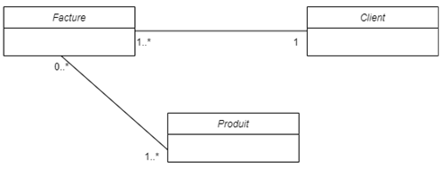

# Exemple généralisation

code de l'exercice Produit-Client-Produit, avec le diagramme de classe suivant:



```cpp
#include <iostream>
#include <vector>
#include <string>
using namespace std;

// aucune des 2 autres classe n'a besoin d'être DANS un produit.
class Produit {
public:
	string nom;
	double prix;

	Produit(string nom, double prix) : nom(nom), prix(prix) {};
};


class Client {
public:
	string nom;
	vector<class Facture*> factures;

	// Passage de facture par référence pour éviter d'attacher la facture au client (le client n'est pas responsable de la durée de vie de la facture
	Client(string nom, class Facture* facture) : nom(nom) {
		//ajouterFacture(facture);
	};

	void ajouterFacture(class Facture* facture) {
		factures.push_back(facture);
	}
};

class Facture {
public:
	int id;
	//ici c'est une référence vers Client, mais puisqu'on force la création de facture pour avoir un client et d'un client pour avoir la facture, on doit faire un choix. Soit on référence le Client ici, mais qu'on ne force pas la facture dans le constructeur de client ou bien on référence le client, mais on accepte que la liste de facture soit à 0.

	//Client& client;
	vector<class Produit> produits;

	// constructeur avec le client:

	//Facture(int id, class Produit produit, Client& client) : id(id), client(client) {
	//	ajouterProduit(produit);
	//};

	//constructeur sans client
	Facture(int id, class Produit produit) : id(id) {
		ajouterProduit(produit); // on ajoute le premier article obligatoire à la création
	};

	void ajouterProduit(Produit& produit) {
		produits.push_back(produit);
	}

	void afficher() {
		cout << "Produits" << endl;
		for (int i = 0; i < produits.size(); i++) {
			cout << produits[i].nom << ": " << produits[i].prix << endl;
		}
	}
};

int main() {
	Produit prod1("ordinateur", 1200);
	Produit prod2("souris", 30);
	Produit prod3("clavier", 50);

	Facture fact1(2, prod1);
	fact1.ajouterProduit(prod2);
	fact1.ajouterProduit(prod3);

	Client client1("Marie", &fact1);
	
	fact1.afficher();

	return 0;

}
```