# Normalisation

Processus de l’organisation des champs et des tables pour réduire la redondance des données et les anomalies de mise à jour (update, delete, insert). Le processus de normalisation s’assure de protéger l’intégrité des données.

Les formes normales définissent les règles de conception pour les bases de données relationnelles .

Chaque table contient des données sur un seul sujet (entité) et une seule chose. La forme universelle (UNF) est la collection de toutes les données en relation (qui est généralement fortement redondante). On va vouloir remplacer par une collection de relations non-redondantes en faisant attention de ne pas perdre d’information (perdre une ou plusieurs colonnes ou bien faire des associations erronées lors de la jointure des tables).

# Première forme normale (1NF)
Dans cette étape, on aplatit les données brutes en mettant des noms de champs et les valeurs à l’intérieur. On part d’une situation réelle et on commence à normaliser. Par exemple, si on souhaite sauvegarder les données rattachées aux factures d’un commerce, on a comme point de départ cet article bien connu.

Il faut donc réfléchir aux champs à mettre dans une première version de table. On va « mettre à plat » les données.

Ensuite, pour chacune des tables, tous les champs ne devraient contenir qu’une seule valeur et n’avoir aucun groupe qui se répète. Chaque enregistrement (ligne) doit être unique.

Les règles sont :
-	Une seule valeur et un seul type par colonne
-	Les valeurs dans les colonnes sont « atomiques », c’est-à-dire qu’on ne peut pas les décomposer plus.
-	Il faut une clé primaire
-	Pas d’attributs qui se répètent (item1, item2…)

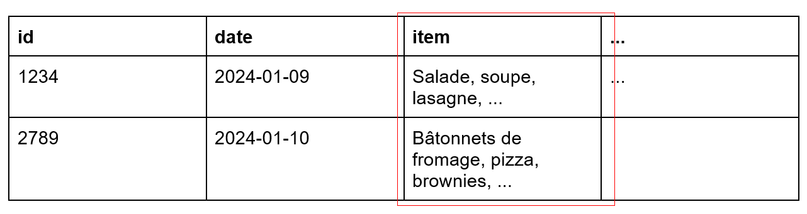

Cet exemple ne respecte pas la 1NF, car il y a un groupe d’information qui se répète. On pourrait être tenté de séparer les champs item1 et item2 dans une seconde table comme ceci:

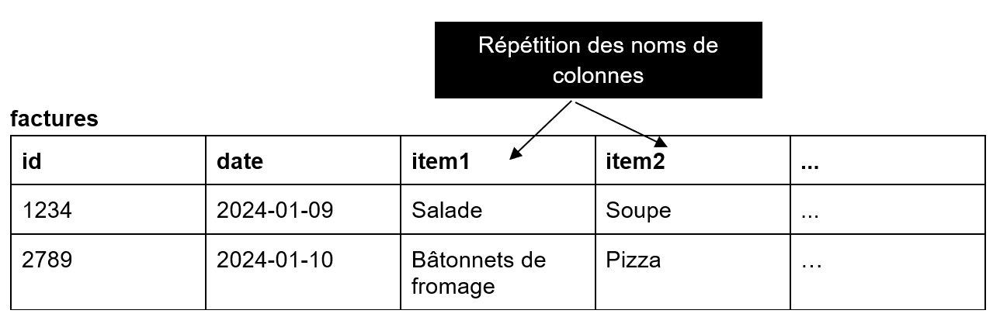

Par contre, le nombre de colonnes variable est très peu recommandé... On peut faire ceci à la place:

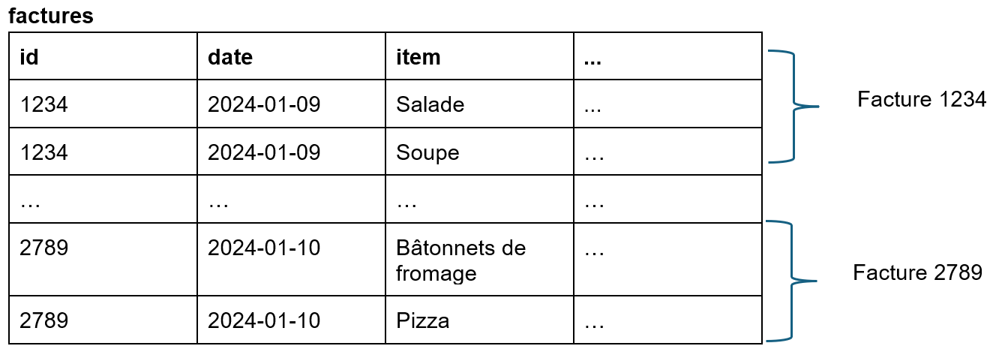

Maintenant, chaque enregistrement (ligne) est unique, chaque case contient une seule valeur et on a une clé primaire. Les données sont aplaties, en forme 1NF.

# Deuxième forme normale (2NF)

Il faut choisir la clé primaire PK (composée ou non) en se demandant si tous les autres champs dépendent de cette clé.

La deuxième forme normale (2NF) indique qu’il faut séparer les champs d’une table si ceux-ci ne sont pas définis par les champs identifiants (clés). Il faut aussi que la table respecte les critères de la 1NF

En d’autres mots : est-ce que les colonnes dépendent de la totalité de la clé primaire?

### Exemple de la facture:

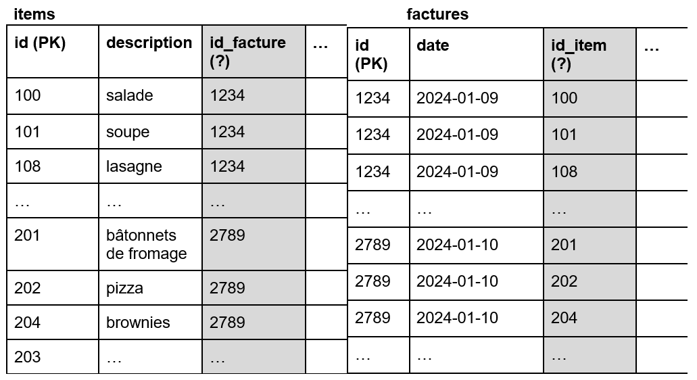

### Exemple 2

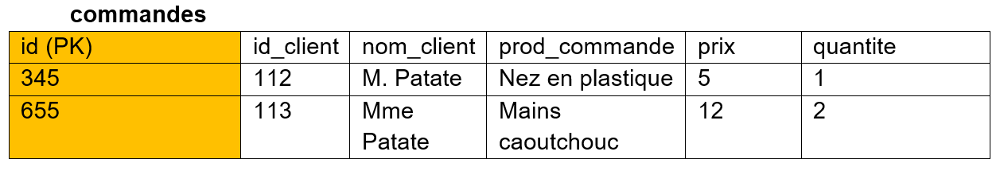

Elle n’est PAS en 2NF. En effet, les attributs « non-clé » (tous sauf id) ne dépendent pas exclusivement de la PK de cette table. En effet, id_client, par exemple, peut être associé à plusieurs autres commandes et n’est pas associé directement avec le numéro de commande.

Il faut donc une table pour les clients à part et aussi une table produits à part, en prenant soin de garder un lien (FK) entre les tables :

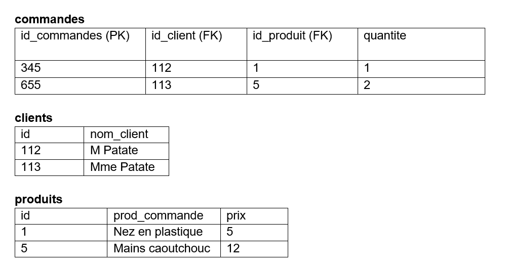

# Troisième forme normale

La troisième forme normale doit :
- d’abord être en 2NF et 
- s’assurer qu’un attribut non-identifiant ne dépend pas d’un autre attribut non-identifiant.
- pas de transitivité (dépendre d'un champ qui dépend de la clé)

Cela signifie que la modification d’une colonne non-clé pourrait entraîner le changement d’une autre colonne non-clé.

Exemple qui ne respecte pas la 3NF :

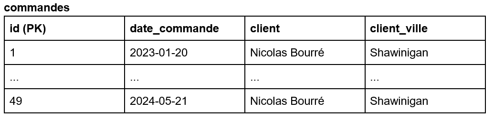

Cet exemple ne respecte pas la 3NF, car le champs client_ville fournit de l’information spécifique au client, qui n’est pas la clé primaire de cette table. Il faudra qu’il y ait une table “clients” et que dans la table “commandes” nous ne retrouverions que la clé primaire de “clients” en guise de FK.

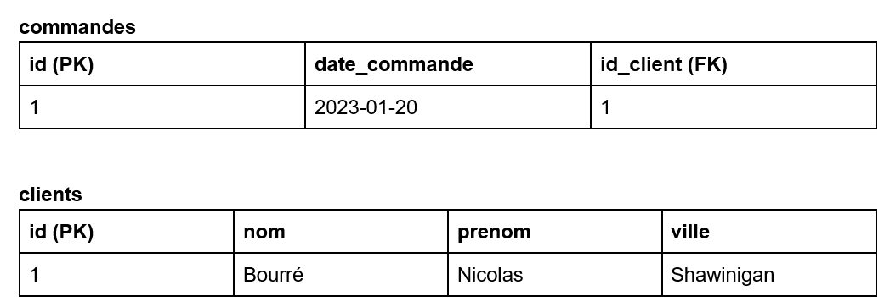

### Exemple 3

[Source](https://www.guru99.com/fr/database-normalization.html) de l'exemple.

#### Forme non normalisée:

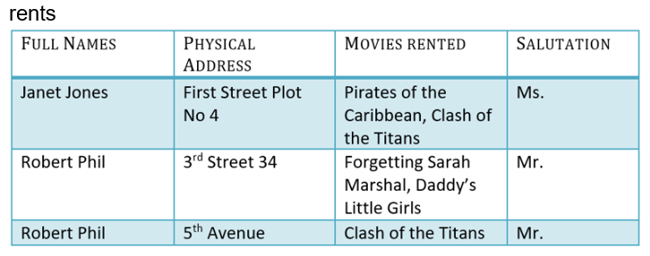

#### Forme 1NF

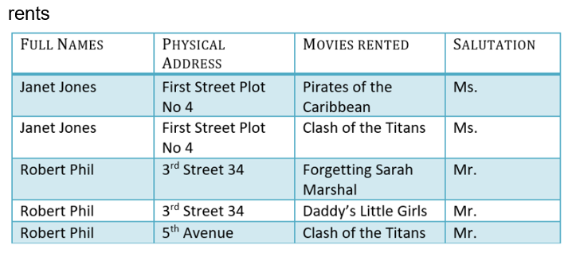

#### Forme 2NF

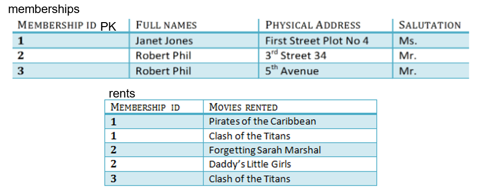

#### Forme 3NF

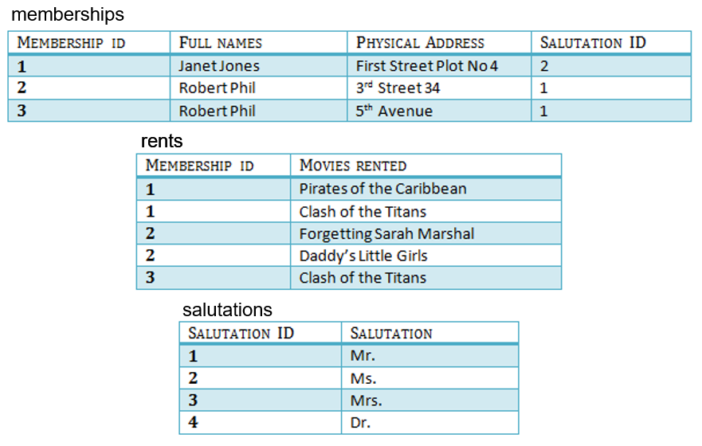

### Exemple 4

Selon la [source](https://www.youtube.com/watch?v=GFQaEYEc8_8) ci-présente, on a une table de joueurs à un certain jeu et les joueurs ont des niveaux d’habileté comme ceci :

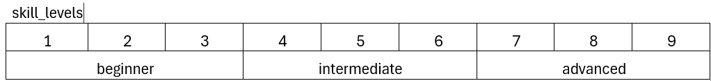

On a une table faite comme ceci:

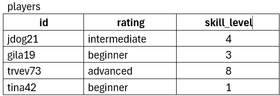

Est-ce qu’elle est en 3NF? Pourquoi?

Les autres formes normales se nomment 
-	BCNF (Boyce Codd normal form)
-	4NF
-	5NF

Dans la majorité des cas, si une table est en 3NF, elle est complètement normalisée. Gardez en tête la phrase suivante :

** Les champs doivent dépendre de la clé, entièrement de la clé et seulement de la clé dans la table où ils se trouvent. ** 

