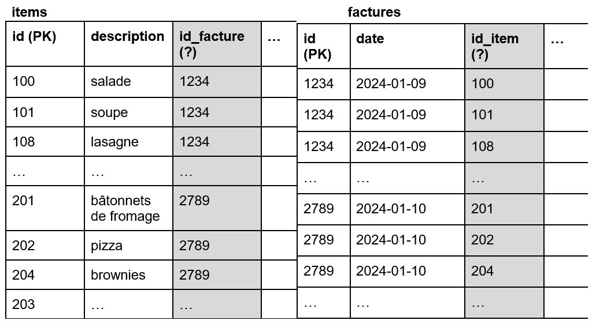
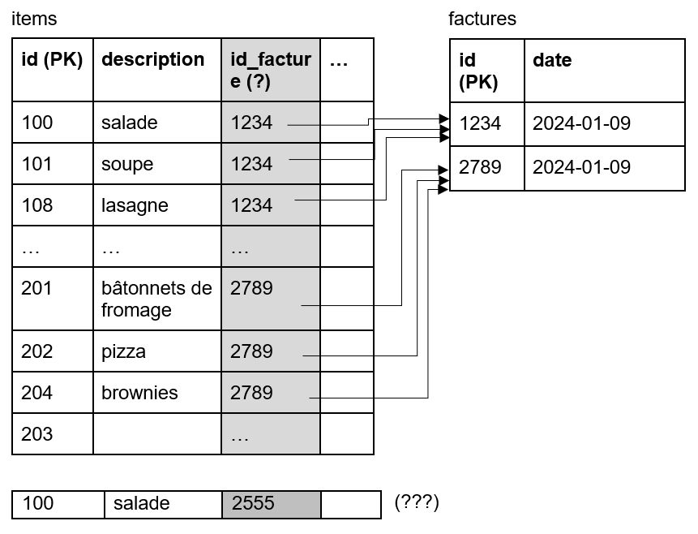
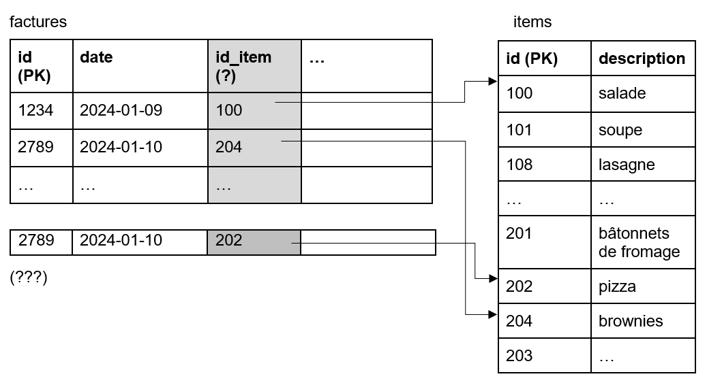
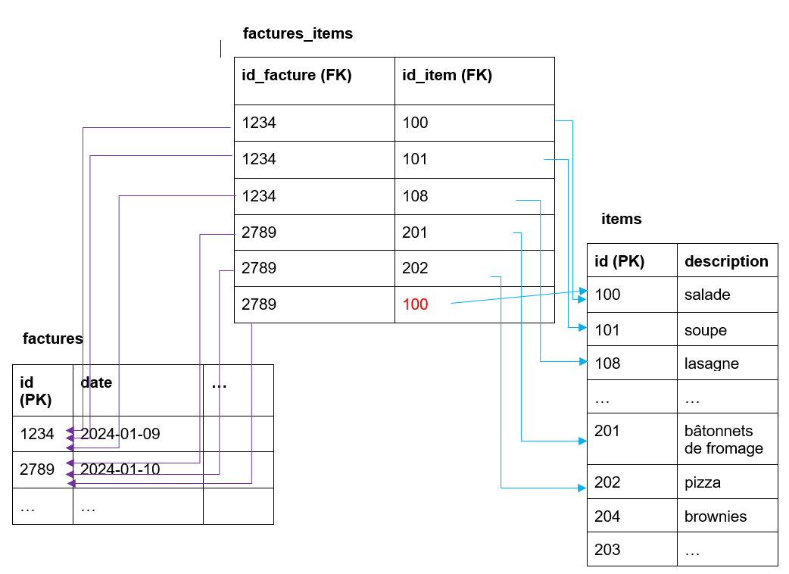

# Tables de liaison

Revenons à l'exemple vu dans la section Normalisation par rapport aux factures et aux items:

Cette situation sème la confusion... en effet, si on met la FK dans la table item, on force l'item a appartenir à une seule facture (très mauvais pour les affaires!). Si la salade a une référence vers la facture 1234, plus aucune autre facture ne pourra avoir de salade... En effet, l'insertion d'une autre ligne avec de la salade briserait l'unicité de la PK:

Si on fait l'autre choix, de mettre la FK dans la table factures qui pointe vers la table items, on n'est pas plus avancés...une facture ne pourra contenir qu'un seul item pour éviter un doublons de PK sur le numéro de facture...

## Solution: Table de liaison!

Cette situation se produit parce que nos tables ont besoin de pointer vers plusieurs éléments, dans un sens ou dans l'autre... C'est une liaison dont la multiplicité est PLUSIEUR à PLUSIEURS. Il faut donc absolument une table de liaison pour parvenir à modéliser ces tables.

On a donc l'ajout d'une table qui contient que des lignes uniques: des duos de factures-items. On ne peut pas avoir 2 fois la même salade sur la même facture. On peut avoir une QUANTITÉ de salades identiques supérieure à 1, mais il s'agit du même item. 

