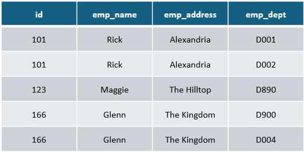
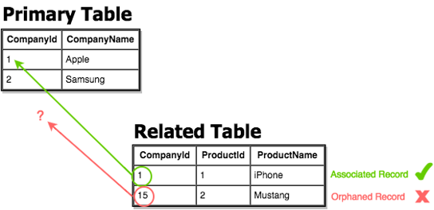

# Anomalies dans les SGBD

Il existe trois types d'anomalies qui se produisent lorsque la base de données n'est pas normalisée
- Anomalie d'insertion, 
- Anomalie de mise à jour 
- Anomalie de suppression

Prenons un exemple pour comprendre
Supposons qu’une entreprise de fabrication stocke les détails de l’employé dans une table nommée `employee` qui possède quatre attributs
- `id` pour stocker l’identifiant de l’employé
- `emp_name` pour stocker le nom de l’employé
- `emp_address` pour stocker l’adresse de l’employé
- `emp_dept` pour stocker les détails du service dans lequel travaille l’employé

Voici la table:

La table n’est pas normalisée, nous allons voir les problèmes que cela peut engendrer.

1. Anomalie de mise à jour:

    - Nous avons deux lignes pour l'employé Rick car il appartient à deux départements.
    - Si nous voulons mettre à jour l'adresse de Rick, nous devons mettre à jour la même chose sur deux lignes ou les données deviendront incohérentes.
    - Si d'une manière ou d'une autre, l'adresse correcte est mise à jour dans un département mais pas dans un autre, selon la base de données, - Rick aurait deux adresses différentes, ce qui n'est pas correct et entraînerait des données incohérentes.

2. Anomalie d’insertion
    - Supposons que l’on embauche un nouvel employé qui est en formation et qui n’est pas assigné à un département
    - Si l’attribut « emp_dept » ne permet pas les valeurs nulles, il ne sera pas possible d’ajouter l’enregistrement

3. Anomalie de suppression
    - Supposons qu’il y a une restructuration dans l’entreprise et que l’on décide de fermer le département D890
    - En supprimant le département D890, on supprime aussi les informations de Maggie, car c’est le seul département où elle est assignée.

# Intégrité référentielle

- L’intégrité référentielle fait référence à l’exactitude et la consistance des données dans une relation 
- Dans les relations, les données sont liées entre deux ou plusieurs tables. Pour ce faire, la clé étrangère (dans la table associée) fait référence à une valeur de clé primaire (dans la table principale ou parent). Pour cette raison, nous devons nous assurer que les données des deux côtés de la relation restent intactes.
- Ainsi, l'intégrité référentielle exige que, chaque fois qu'une valeur de clé étrangère est utilisée, elle doit référencer une clé primaire valide et existante dans la table parent.

### Exemple

    Par exemple, si nous supprimons la ligne numéro 15 dans une table primaire, nous devons nous assurer qu'il n'y a pas de clé étrangère dans aucune table associée avec la valeur 15. Nous ne devrions pouvoir supprimer une clé primaire que s'il n'y a pas de lignes associées . Sinon, nous nous retrouverions avec un enregistrement orphelin.

L'intégrité référentielle empêchera donc les utilisateurs de:
- Ajouter de lignes à une table associée s'il n'y a pas de ligne associée dans la table primaire. 
- Modifier des valeurs dans une table principale qui entraînent des enregistrements orphelins dans une table associée.
- Supprimer des lignes d'une table principale s'il existe des lignes associées correspondantes.

### Protection de l'intégrité

Pour renforcer l’intégrité référentielle on peut utiliser les méthodes indiquées ci-dessous:

- Empêcher l’utilisateur de modifier la clé primaire
- Éviter la suppression d’un enregistrement parent s’il possède des enfants ou faire de la suppression en cascade
- La suppression en cascade permet au SGBD de supprimer les enregistrements enfants automatiquement via la relation
- Utiliser des listes de valeurs lors de la sélection d’enregistrement parent
    - Par exemple, une liste de pays ou de provinces
