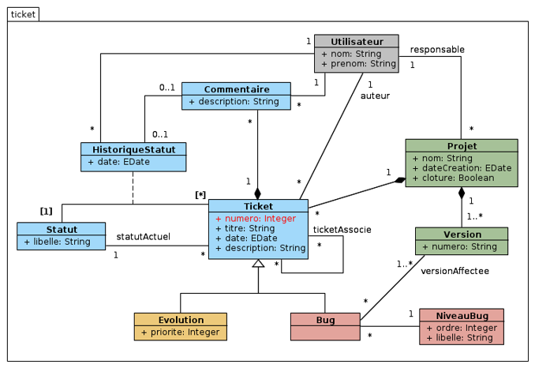
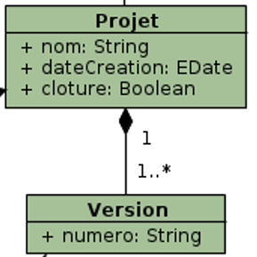
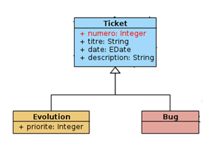
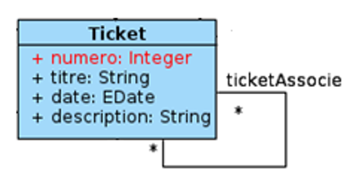
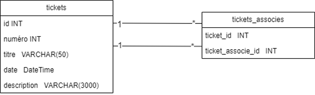
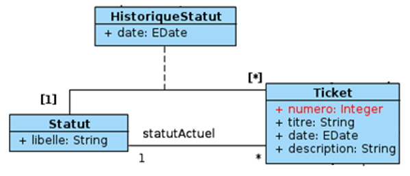

# Script SQL 

Vous avez déjà un compte et une connexion à un serveur de BD actif dans le cours de Développement en entreprise 1.

Sinon, j'utilise SSMS (SQL Server Management studio) avec SQL Server 2022.

## Passer du diagramme au script

Que vous passiez du diagramme de classe aux tables ou du MRD aux tables, en développement, il faut inévitablement passer par le script de création des tables de notre projet.

Les étapes pour la création du script:
- Créer une BD si elle n’existe pas déjà
- Créer une table par classe, si elles n’existent pas déjà
- Créer les colonnes
    - penser aux attributs NOT NULL, DEFAULT, ...
    - penser à une valeur par défaut si on a du NOT NULL 
- Définir les clés primaires
- Définir les clés étrangères
- S’assurer que l’ordre de création des tables est le bon
- Ajouter les index là où nécessaire

## NULL ou NOT NULL?

`NOT NULL` = le champ est obligatoire, il doit toujours avoir une valeur.

`NULL` = le champ est facultatif, la valeur peut être inconnue ou absente.

### Quand utiliser NOT NULL :
- La colonne est essentielle à l'identité ou au fonctionnement de l'enregistrement.
- La colonne est une clé primaire ou une clé étrangère.
- pour éviter les problèmes de logique (ex. : comparaisons avec NULL peuvent donner des résultats inattendus).
- on sait que l’information sera toujours fournie (ex. : nom, mot_de_passe, date_creation).

### Quand permettre NULL :
- L’information n’est pas toujours disponible au moment de l’insertion.
- La colonne est optionnelle (ex. : numero_telephone, photo_profil, date_demission).
- La donnée dépend d’un contexte ou d’une action future (ex. : note_finale d’un étudiant qui n’a pas encore fini le cours).

## Types des champs

Dans SQL server, voici les types:

| Type SQL Server     | Description                                     | Exemple de données             |
|---------------------|-------------------------------------------------|--------------------------------|
| `int`               | Entier (de -2,147,483,648 à 2,147,483,647)      | `42`                           |
| `bigint`            | Grand entier                                    | `9876543210`                   |
| `smallint`          | Petit entier (de -32,768 à 32,767)              | `120`                          |
| `tinyint`           | Très petit entier (0 à 255)                     | `200`                          |
| `bit`               | Booléen (0 = faux, 1 = vrai)                    | `1` ou `0`                     |
| `decimal(p,s)`      | Nombre décimal (précision et échelle)           | `decimal(8,2)` → `12345.67`   |
| `float`             | Nombre à virgule flottante                      | `3.14159`                      |
| `money`             | Montant en argent                               | `199.99`                       |
| `char(n)`           | Chaîne fixe de `n` caractères                   | `char(10)` → `"abc   "`   |
| `varchar(n)`        | Chaîne variable de max `n` caractères           | `varchar(50)` → `"bonjour"`   |
| `nvarchar(n)`       | Comme `varchar`, mais accepte les accents       | `nvarchar(50)` → `"café"`     |
| `date`              | Date sans heure                                 | `2025-04-09`                   |
| `datetime`          | Date et heure                                   | `2025-04-09 13:45:00`         |
| `time`              | Heure seulement                                 | `13:45:00`                     |
| `uniqueidentifier`  | Identifiant global unique (UUID/GUID)           | `6F9619FF-8B86-D011-B42D...`   |

## Options des colonnes

Name : Nom de la colonne
Type : Type de la colonne (plusieurs choix)
Primary Key : Clé primaire
Allow Nulls : permet les valeurs nulles
Default value : valeur par défaut (doit être compatible avec le type du champ)
UNIQUE: champs qui n'est pas la clé, mais qui est unique.

Rappel: La valeur NULL n’est pas égale à 0 ni à une chaîne de caractère vide.

Si on a un NOT NULL, on peut aussi mettre une valeur par défaut (DEFAULT) pour palier à une insertion avec champs vide.


## Script du projet

Si vous partez un projet de 0, il se peut que vous ayez une base de données à créer. La plupart du temps, on ajoute des éléments dans une BD qui existe déjà. Pour les exemples

Pour pratiquer, nous allons prendre le modèle du domaine suivant. Il manque des colonnes, que nous devront réfléchir et ajouter. On retrouve les flèches et symboles d'agrégation, de composition et d'héritage, on verra leur interprétation en BD. Le script de BD peut se faire à partir de plusieurs outils: modèle du domaine, modèle relationnel des données ou normalisation.



Les scripts de création doivent toujours être exécutables et ne pas planter. Il est donc obligatoire en tout temps de mettre des conditions qui offrent les alternatives:

### Création d'une BD

```sql
IF NOT EXISTS (SELECT * FROM sys.databases WHERE name = 'tickets')
BEGIN
    CREATE DATABASE tickets;
    PRINT 'La base de données a été créée.';
END
ELSE
BEGIN
    PRINT 'La base de données existe déjà.';
END
```

### Création de tables

En utilisant la méthode désirée, on va ajouter les tables suivantes. Pour garder l'uniformité, les noms de tables sont en minuscule au pluriel, snake_case:
- utilisateurs
- commentaires
- historique_statuts
- tickets
- statuts
- projets
- versions
- evolutions
- bugs
- niveau_bugs

Il est aussi possible de créer une table en mode graphique (clique-clique) et de faire générer le script ensuite.

Il faut aussi penser à l'ordre de création des tables. Les tables "feuilles", c'Est-à-dire celles vers lesquelles les autre pointent, doivent être créées en premier. Ici, on mets plus de détails que dans le schéma initial:

- id est auto-incrémenté (on le nomme id seulement, c'est la PK de sa table)
- on décide que nom et prénom ne peuvent pas être NULL. Donc, si le code "échappe" la vérification, la BD va refuser l'insertion s'il manque une info. 

```sql
IF EXISTS (SELECT * FROM sys.tables WHERE name = 'utilisateurs')
BEGIN
    PRINT 'La table utilisateurs existe déjà.';
END
ELSE
BEGIN
    CREATE TABLE utilisateurs (
        id INT IDENTITY PRIMARY KEY,
        nom VARCHAR(50) NOT NULL,
        prenom VARCHAR(50) NOT NULL
    );
END
```

## Clés primaires et étrangères

Dans le cadre de ce cours et des projet ou évaluations qui s'y rattachent, on va mettre un id auto-incrémenté à chaque table comme clé primaire. La réflexion des clés naturelles se fait AVANT d'arriver au script, pour la normalisation. La clé primaire est toujours créée lors de la création de la table.

Les clés étrangères s'ajoute dans la création de la table ou après (quand la table existe déjà).

Exemple **à la création**:
```sql
IF EXISTS (SELECT * FROM sys.tables WHERE name = 'projets')
BEGIN
    PRINT 'La table projets existe déjà.';
END
ELSE
BEGIN
    CREATE TABLE projets (
        id_projet INT IDENTITY PRIMARY KEY,
        nom VARCHAR(200) NOT NULL,
        date_creation DATETIME2 NOT NULL DEFAULT SYSDATETIME(), -- date du jour par défaut
        cloture BIT default 0,
        id_responsable int, -- ajout de la colonne (NULL ou NOT NULL?)
        CONSTRAINT FK_projets_utilisateurs FOREIGN KEY (id_responsable) REFERENCES utilisateurs (id) -- référence
    );
END
```

On crée la CONSTRAINT pour la supprimer ou la manipuler plus facilement après. Ici par défaut, on ne peut pas effacer un utilisateur (RESTRICT) qui aurait un projets associé.

Exemple **après la création**:

```SQL
IF NOT EXISTS (
    SELECT * FROM sys.foreign_keys WHERE name = 'FK_projets_utilisateurs'
)
BEGIN
    ALTER TABLE projets
    ADD CONSTRAINT FK_projets_utilisateurs
    FOREIGN KEY (id_responsable)
    REFERENCES utilisateurs(id);
END
```

On ajoute une FK si notre projet nous amène à connecter une table existante avec une nouvelle table par exemple.


## Gérer les compositions

Pour gérer les relations de COMPOSITION, il faut se rappeler que les enfants n’ont aucun sens sans le parent. Il faut donc créer une relation de parent-enfant (foreign key) dans laquelle la suppression du parent entraîne la suppression des enfants. Idem pour la mise à jour.



Relation 1 à plusieurs: la table plusieurs pointe vers la table 1 avec un FK. On spécifiera ON DELETE CASCADE pour que, si un projet est supprimé, on supprime les versions associées qui n’ont plus de sens sans le projet. Même chose pour ON UPDATE CASCADE

## Gérer les agrégations

Le comportement et les FK à placer sont similaires à la composition. Toutefois, si un parent est supprimé, on ne supprime pas nécessairement son enfant, qui peut exister seul, à part entière.

On pourrait donc adopter un « on DELETE set NULL » et « on UPDATE CASCADE »... encore une fois, "ça dépend", il faut savoir ce qu'on veut et ce qui est logique.

## Gérer la généralisation (héritage)

Puisque les bugs et les évolutions sont des tickets plus précis, on fera une FK des tables enfants vers la table parent.

La suppression d’un ticket devrait aussi supprimer sa présence dans bug ou dans évolution. On veut donc supprimer en cascade ou bien, si la perte des informations n’est pas possible pour conserver l’historique, on fait RESTRICT. Ici, disons qu’on CASCADE.



## Gérer les cas particuliers

### Comment gérer ce cas?



Table de liaison!



### Et celui-ci?



La table statuts et historiques se comprend de la manière suivante:
Chaque ticket a un seul statut, mais celui-ci pourra changer. Pour gérer la situation, on a besoin d’un enregistrement à chaque changement de statut.

Il faudra donc que le status_actuel soit placé comme FK dans tickets et qu’un TRIGGER soit mis en place pour qu’à chaque update de ce champ, une ligne soit insérée dans la table historiqueStatut. 

Attention d’insérer tous les champs! Le schéma des tables a plus de colonnes que ce qu’on voit à cause des FK

# LABO

Faire le script complet du schéma des tables de l'environnement `tickets`. 
- On fera les TRIGGER, CHECK et INDEX plus tard
- Proposer types cohérents pour les colonnes
- Attention à l'ordre de création des tables!

