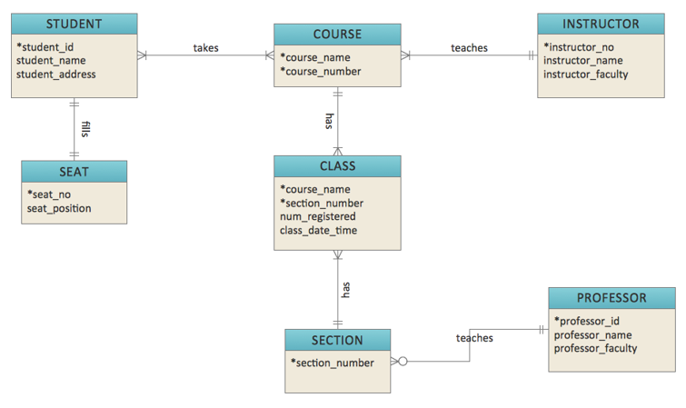
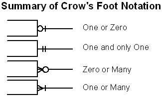

# Exercices

Créer les tables en SQL en réfléchissant aux types de champs, aux clés, aux comportement attendu lors des suppression et update. À titre indicatif, le diagramme peut avoir l'aire de ceci:

C'est la notation Crows foot, qui se décode comme suit:

