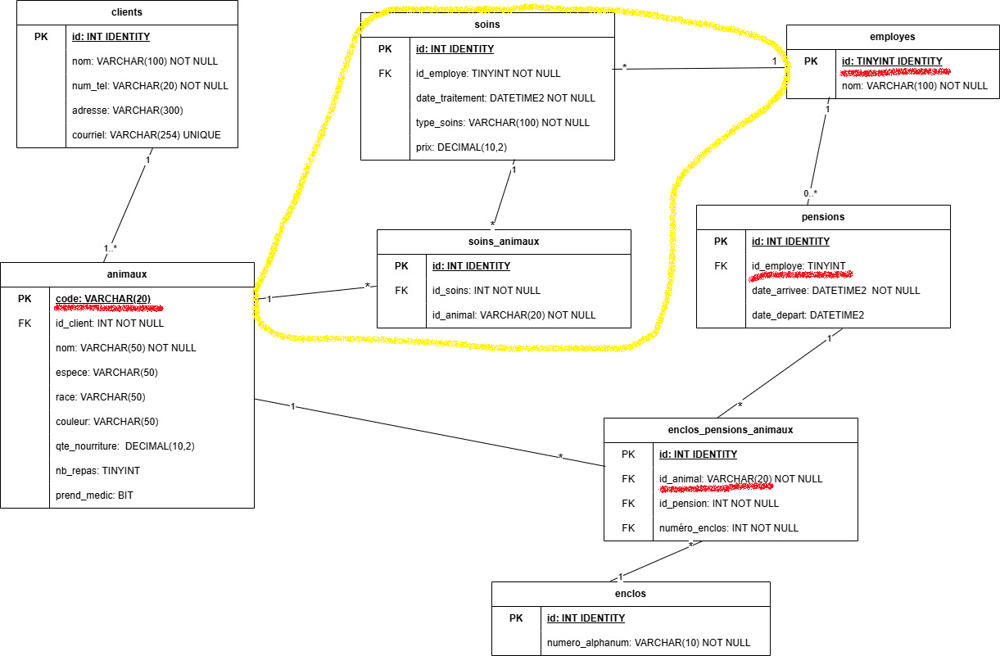

# Annexer son projet à une base de données existante

La plupart du temps, quand on développe un projet, on doit se connecter aux tables existantes et peuplées dans une BD donnée. Il faut donc être sûr d'ajouter les éléments voulu correctement.

## Ajout simple: aucune altération des tables

Prenons animalerie. Si on souhaite ajouter des soins comme la coupe de griffe ou le toilettage, par exemple, on doit ajouter des tables à notre schéma, qui se connecteront à nos tables existantes. Pour montrer une variante et pour montrer les implication, j'ai changé le type des PK de la table animaux et employes.



## Ajout d'une colonne dans une table déjà peuplée

Ajouter la colonne est_qualifie_soins à la table employes. On veut que la colonne soit non-nulle. Si on met un NOT NULL sans DEFAULT, il y aura une erreur.

```sql
ALTER TABLE employes
ADD est_qualifie_soins BIT NOT NULL DEFAULT 0
```

Il sera ensuite possible de faire un script pour modifier les valeurs dans la nouvelle colonne.

## Soft delete (suppression douce)

Si on ne veut pas perdre la trace de certains éléments, on peut ajouter une colonne pour mettre un "drapeau" sur le fait d'être actif ou non. Un booléen à 1 veut dire actif, 0 veut dire inactif.

```sql
-- ajouter la colonne drapeau
ALTER TABLE employes
ADD est_actif BIT NOT NULL DEFAULT 1


-- créer le trigger
CREATE TRIGGER trg_SoftDeleteEmploye
ON employes
INSTEAD OF DELETE
AS
BEGIN
    UPDATE e
    SET est_actif = 0
    FROM employes e
    INNER JOIN deleted d ON e.id = d.id;
END;
```

Comment le tester?